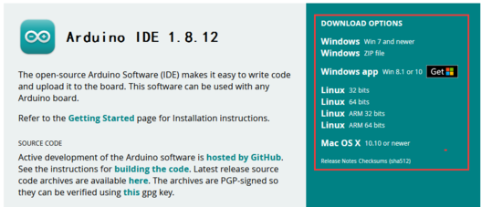
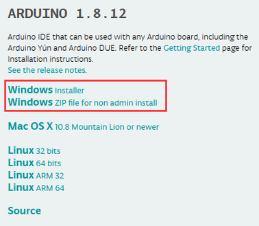
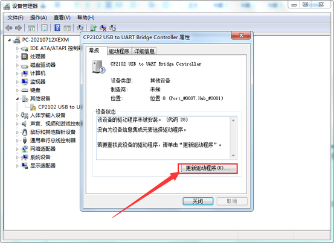
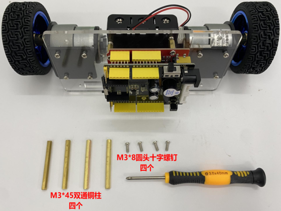
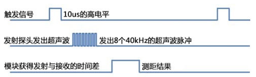
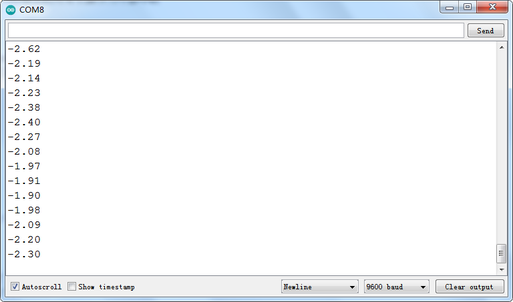

# Arduino教程

## 开发环境配置

1 安装 IDE

拿到这个控制板后，我们首先需要下载安装Arduino IDE。

你可以进入以下网址下载Arduino IDE：<https://www.arduino.cc/>，点击后，显示如下图。


点击下图，



就可以下载最新的1.8.12版本IDE。

同时我们可以点击下图，选择你需要的版本IDE。


我们选择安装1.8.12版本Arduino IDE，当我们点击，代表下载安装文件(.exe)，需要手动安装。当我们点击，代表直接下载1.8.12版本Arduino IDE，是一个压缩文件，解压就可以使用，无需安装。



2 开发板驱动安装

软件下载完毕，我们开始为Keyes Uno Plus 开发板安装驱动。Keyes Uno Plus开发板的USB转串口芯片用的是著名的CP2102 芯片，在ARDUINO开发软件1.8以上的版本里就已经包含了这个芯片的驱动程序，这样我们使用起来会非常方便。一般插上USB，电脑就会识别到硬件，WINDOWS就会自动安装CP2102的驱动。


如果驱动安装不成功，或者你想手动安装驱动，请打开电脑的设备管理器


显示CP2102的驱动没有安装成功，有一个黄色的感叹号。我们双击硬件更新驱动



浏览计算机查找驱动程序，先找到我们安装或者下载的ARDUINO开发软件，


里面有个DIRVERS文件夹，打开文件夹就能看到CP210X系列芯片的驱动，


我们选择这个文件夹，然后点击确定，驱动安装成功。

这个时候再打开设备管理器，我就可以看到CP2102的驱动程序已经安装成功了，刚刚的那个黄色的感叹号不见了。


3 IDE设置和工具栏介绍

首先我们点击文档中的图标，打开Arduino IDE。


为了避免在将程序上载到板上时出现任何错误，必须选择正确的Arduino板名称，该名称与连接到计算机的电路板相匹配。转到Tools→Board，然后选择你的板。


然后再选择正确的COM口（安装驱动成功后可看到对应COM口）。


我们的程序上传到板之前，我们必须演示Arduino IDE工具栏中出现的每个符号的功能。


A - 用于检查是否存在任何编译错误。

B - 用于将程序上传到Arduino板。

C - 用于创建新草图的快捷方式。

D - 用于直接打开示例草图之一。

E - 用于保存草图。

F - 用于从板接收串行数据并将串行数据发送到板的串行监视器。

4 启动你的第一个程序

打开文件选择例子，选择第一个文件BASIC里面的BLINK程序


按照前面方法设置板和COM口，IDE右下角显示对应板和COM口。


点击图标开始编译程序，检查错误，检查无误。


点击点击图标开始上传程序，上传成功。


程序上传成功，板载的LED灯亮一秒钟，灭一秒钟，恭喜你的第一个程序完成了！

5 库文件安装

首先找到我们教程文件夹下的库文件夹
然后打开。将里面的库文件全选复制。

找到Arduino IDE安装路径文件下的，将复制的库文件全部粘贴到这个文件夹里面。（如果找不到Arduino IDE的安装路径可以在桌面找到Arduino IDE的图标然后鼠标右击，找到“打开文件位置”单击进入即可）


## KE3046安装步骤

安装1

安装所需零件


安装完成


安装2

安装所需零件


安装完成


安装3

安装所需零件


安装完成


安装4

安装所需零件


安装完成


安装5

安装所需零件


安 装完成


安装6

安装所需零件


安 装


安装7

安装所需零件


安装完成


安装8

安装所需零件


安装完成


安装9

安装所需零件


安装完成


安装10

安装所需零件



安装完成


安装11

安装所需零件


超声波接线


安装12

准备两根缠绕管跟两根6P线材


完成


安装13

安装所需零件


右侧电机接线


左侧电机接线


电源接线


安装蓝牙


安装14

安装所需零件


安装完成


## 项目课程


### 第一课 按钮和蜂鸣器实验

1.  项目介绍：

这节课我们就从一个最基本的小程序入手，进一步了解ARDUINO的世界。

在扩展板上，自带1个按键和1个有源蜂鸣器。其中按键由Plus
板的D13控制，有源蜂鸣器由Plus
板的D11控制。实验中我们控制，当按键按下，有源蜂鸣器响起声音。

有源蜂鸣器自带震荡电路，实际上只需要将D11控制为高电平就能够响起。实验中我们模拟无源蜂鸣器的设置方法，设置不同的方波，有源蜂鸣器也能够输出不同的声音。

2.  使用到其它扩展板介绍：

按键和有源蜂鸣器都集成在扩展板上了


3.  实验代码：

```
const int buz = 11;    //定义蜂鸣器的引脚
const int btn = 13;    //定义按钮的引脚
int button;    //按钮的变量

void setup() 
{
  pinMode(btn,INPUT);       //设置为输入状态
  pinMode(buz,OUTPUT);       //设置为输出状态
}

void loop() 
{
  button = digitalRead(btn);       //将读取到的按钮值赋给变量button
  if(button == 0)    //如果按钮按下去了
  {
    delay(10);    //延时消抖
    if(button == 0)     //再次判断，如果按钮是按下了
    {
      buzzer();  //执行蜂鸣器的子函数
    }
  }
  else        //按钮没按下
  {
    digitalWrite(buz,LOW);    //蜂鸣器不响
  }
}

//蜂鸣器发出“嘀嘀”声响
void buzzer()      
{
    for(int i=0;i<50;i++)
    {
    digitalWrite(buz,HIGH);
    delay(1);
    digitalWrite(buz,LOW);
    delay(1);
    }
    delay(50);
    for(int i=0;i<50;i++)
    {
    digitalWrite(buz,HIGH);
    delay(1);
    digitalWrite(buz,LOW);
    delay(1);
    }
}
```


4.  实验结果：

将平衡车全部安装成功后，上传好测试代码，上电，扩展板上电源控制拨码开关拨至“ON”端后，按下扩展板KEY_13按键后，扩展板上有源蜂鸣器响起，否则不响。

5.  代码说明:


|pinMode（pin，mode）|配置指定的引脚作为输入或输出|
|-|-|
|digitalRead（）|从指定的数字引脚(HIGH或LOW)读取值。|
|digitalWrite（）|写一个高或低的值到一个数字引脚。|
|If( ) { }|if语句检查一个条件，并在条件为“真”时执行以下语句或一组语句。|
|for( ) { }|for语句用于重复用大括号括起来的语句块。递增计数器通常用于递增和终止循环。for语句对于任何重复操作都很有用，通常与数组结合使用来操作数据/引脚集合。|
|delay(50)|延时50毫秒|


如果需要等详细的了解函数和语句或者是其他的函数，请参考：https://www.arduino.cc/reference/en/


### 第二课 超声波测距实验

1.  项目介绍：

HC-SR04超声波传感器像蝙蝠一样使用声纳来确定到物体的距离。
它提供出色的非接触范围检测，具有高精度和稳定的读数。
它带有超声波发射和接收模块。

HC-SR04或超声波传感器被广泛用于创建障碍物检测和距离测量应用以及其他各种应用的电子项目中。
在这里，我们介绍使用arduino和超声传感器测量距离的简单方法.

2.  模块参数：

电源：+ 5V DC

静态电流：\<2mA

工作电流：15mA

有效角度：\<15°

测距范围：2cm – 400 cm

分辨率：0.3厘米

测量角度：30度

触发输入脉冲宽度：10uS

3.  模块原理图：

看超声波传感器的可知，像是有两个眼睛，其一边是发射超声的，一边是接收超声波的，然后检测从发射遇到障碍物返回被接收到所需的时间t，再根据声音在空气中的传播速度大概是343m/s,
距离 = 速度 \* 时间 ，
由于超声波发射返回是两段路程了，所以需要除以2，故超声波测到的 距离
=（速度 \* 时间）/2超声波模块的使用方法及时序图：

1、使用GPIO引脚给SR04的Trig引脚至少10μs的高电平信号，触发SR04模块测距功能；

2、触发后，模块会自动发送8个40KHz的超声波脉冲，并自动检测是否有信号返回。这步会由模块内部自动完成。

3、如有信号返回，Echo引脚会输出高电平，高电平持续的时间就是超声波从发射到返回的时间。



超声波模块的电路图


4.  模块接线图：


5.  实验代码：


```
int trigPin = A0;    // 定义超声波发射脚位
int echoPin = A1;    // 定义超声波接收脚位
long duration, cm, inches;
void setup() {
  Serial.begin (9600);  //开始串口打印
  pinMode(trigPin, OUTPUT); //定义超声波发射为输出
  pinMode(echoPin, INPUT); //定义超声波接收为输入
}
void loop() {
 //传感器由10毫秒或更长时间的高电平脉冲触发
 //预先给短的LOW脉冲以确保稳定高电平脉冲
  digitalWrite(trigPin, LOW);
  delayMicroseconds(2);
  digitalWrite(trigPin, HIGH);
  delayMicroseconds(10);
  digitalWrite(trigPin, LOW);
   //读取来自传感器的信号：一个高脉冲
  //持续时间是指从发送到发送的时间（以微秒为单位）
  // ping到接收对象的回声。
  duration = pulseIn(echoPin, HIGH);
//将时间转换为距离
  cm = (duration/2) / 29.1;     // 除以29.1或乘以0.0343
  inches = (duration/2) / 74;   // 除以74或乘以0.0135
  Serial.print(inches);
  Serial.print("in, ");
  Serial.print(cm);
  Serial.print("cm");
  Serial.println();
  delay(200);
}

```


6.  实验结果：

上传好测试代码到开发板，打开串口监视器，设置波特率为9600，我们可以看到超声波模块显示的距离，单位是厘米和英寸。用手阻挡超声波模块，我们看到显示距离的数值变小了。


7.  代码说明:


|delayMicroseconds(2);|延时2us|
|-|-|
|pulseIn(echoPin, HIGH);|读取脉冲函数|


8.  项目拓展：

如需进一步了解微妙延时函数和读取脉冲函数请参考：https://www.arduino.cc/reference/en/


### 第三课 TB6612电机驱动测试

1.  项目介绍：

上一节课我们测试了扩展板上的按键和有源蜂鸣器。在这课程中，我们主要测试扩展板的电机驱动能力。实验中，我们用Plus
板的D8 D12控制右边电机方向，D10控制右边电机的速度；D7 D6控制左边电机方向，D9控制左边电机的速度。具体控制方法如下图。


|D8|D12|D10/PWM|右边电机状态|D7|D6|D9/PWM|左边电机状态|
|-|-|-|-|-|-|-|-|
|HIGH|LOW|0-255|前进|HIGH|LOW|0-255|前进|
|LOW|HIGH|0-255|后退|LOW|HIGH|0-255|后退|
|HIGH|HIGH|/|停止|HIGH|HIGH|/|停止|
|LOW|LOW|/|停止|LOW|LOW|/|停止|


其中D9 D10也是Plus
板的PWM口，既可以做数字输出，也可以作为模拟输出，如果作为模拟输出，就需要用到ARDUINO的analogWrite()
命

令,analogWrite()
命令中可以操控的范围为0-255，analogWrite(255)表示100%占空比（常开），analogWrite(127)占空比大约为50%（一半的时间）。

代码中，当D9和D10设置的PWM值越大，两个电机转动越快。实验中，我们只是简单的控制左右两个电机正转。

2.  实验代码：

```
//TB6612引脚定义
const int right_R1=8;    
const int right_R2=12;
const int PWM_R=10;
const int left_L1=7;
const int left_L2=6;
const int PWM_L=9;

void setup() 
{
  Serial.begin(9600);          //串口波特率为9600
  
  pinMode(right_R1,OUTPUT);     //TB6612的引脚都设置为输出
  pinMode(right_R2,OUTPUT);
  pinMode(PWM_R,OUTPUT);
  pinMode(left_L1,OUTPUT);
  pinMode(left_L2,OUTPUT);
  pinMode(PWM_L,OUTPUT);
}

void loop() 
{
  //两电机都正转
  digitalWrite(right_R1,HIGH);
  digitalWrite(right_R2,LOW);
  digitalWrite(left_L1,HIGH);
  digitalWrite(left_L2,LOW);
  analogWrite(PWM_R,100);   //写入PWM值0~255（速度）
  analogWrite(PWM_L,100);
}
```


3.  实验结果：

将平衡车全部安装成功后，上传好测试代码，上电，扩展板上电源控制拨码开关拨至“ON”端后，左右两个电机开始正转。


### 第四课 霍尔编码器实验

1.  项目介绍：

在前面课程中，我们介绍到可以通过设置D9 D10的PWM值设置左右两个电机的速度。但是具体电机是什么速度，我们可通过电机上自带的霍尔编码器来测试。在这一课程中，我们测试在100毫秒时间内，霍尔编码器得到的脉冲数，我们就可以通过脉冲数目计算出具体速度。

2.  实验代码：

```
//TB6612引脚定义
const int right_R1=8;    
const int right_R2=12;
const int PWM_R=10;
const int left_L1=7;
const int left_L2=6;
const int PWM_L=9;

const int PinA_left = 5;    //定义检测左电机脉冲的引脚为D5
const int PinA_right = 4;    //定义检测右电机脉冲的引脚为D4

int times=0,newtime=0,d_time=100;   //时间，最新的时间，时间间隔
int valA=0,valB=0,flagA=0,flagB=0;    //变量valA和valB用于计算脉冲数

void setup() 
{
  Serial.begin(9600);
  
  pinMode(right_R1,OUTPUT);    //TB6612的引脚都设置为输出
  pinMode(right_R2,OUTPUT);
  pinMode(PWM_R,OUTPUT);
  pinMode(left_L1,OUTPUT);
  pinMode(left_L2,OUTPUT);
  pinMode(PWM_L,OUTPUT);

  pinMode(PinA_left,INPUT);    //设置检测脉冲的引脚为输入状态
  pinMode(PinA_right,INPUT);

}

void loop() 
{
  //两电机都正转
  digitalWrite(right_R1,HIGH);
  digitalWrite(right_R2,LOW);
  digitalWrite(left_L1,HIGH);
  digitalWrite(left_L2,LOW);
  analogWrite(PWM_R,100);   //写入PWM值0~255（速度）
  analogWrite(PWM_L,200);

  newtime=times=millis();     //使变量newtime和times都等于程序运行到这的时间
  while((newtime-times)<d_time)    //如果小于设定时间d_time，就一直循环
  {
    if(digitalRead(PinA_left)==HIGH&&flagA==0)   //如果检测到高电平
    {
      valA++;      //valA加1
      flagA=1;
    }
    if(digitalRead(PinA_left)==LOW&&flagA==1)    //如果检测到低电平
    {
      valA++;     //valA加1
      flagA=0;
    }
    
    if(digitalRead(PinA_right)==HIGH&&flagB==0)
    {
      valB++;
      flagB=1;
    }
    if(digitalRead(PinA_right)==LOW&&flagB==1)
    {
      valB++;
      flagB=0;
    }
    newtime=millis();        //newtime等于程序运行到这的时间
  }
  Serial.println(valA);      //打印出valA和B的值
  Serial.println(valB);
  valA=valB=0;             //置0
}
```


3.  实验结果：

将平衡车全部安装成功后，上传好测试代码，USB线不拔掉，上电，扩展板上电源控制拨码开关拨至“ON”端。打开Arduino IDE
设置波特率为9600，串口监视器显示在100毫秒时间内，霍尔编码器得到的脉冲数（对应左右两个电机），如下图。


4.  代码说明:


|Serial.begin(9600);|设置串口波特率为9600|
|-|-|
|While( )|while循环将持续无限循环，直到括号内的表达式，()变为false。必须改变所测试的变量，否则while循环永远不会退出。这可以在代码中，比如一个递增的变量，或者一个外部条件，比如测试一个传感器。|
|Serial.println( );|串口打印语句，打印括号中的值或者字符|


### 第六课 蓝牙模块测试

1.  项目介绍：

在前面课程中，学习了电机的驱动方法。这款平衡车套件中包含一个蓝牙模块。这个蓝牙模块只兼容安卓系统的手机。在这一课程中，学习利用我们提供的APP，让平衡车和安卓手机蓝牙连接通信。同时让我们的APP控制平衡车各种工作状态。

注意：扩展板上具有控制蓝牙通信的拨码开关（在蓝牙模块下方）。当我们需要上传测试代码时，拨码开关必须拨打到OFF端，否则代码上传失败；当我们需要连接蓝牙模块时，拨码开关拨打到ON端。

2.  模块参数：

1）蓝牙协议：蓝牙 2.1+EDR 标准

2）USB 协议：USB v1.1/2.0

3）工作频率：2.4GHz ISM 频段

4）调制方式：高斯频移键控

5）发射功率：≤ 4dBm，第二级

6）灵敏度： ≤-84dBm at 0.1% 误信率

7）传输速率：2.1Mbps(Max)/160 kbps(Asynchronous)；1Mbps/1Mbps(Synchronous)

8）安全特性：认证和加密

9）支持配置：蓝牙串口（从机）

10）供电电压：+3.3 VDC 50mA

11）工作温度：-20 到 55 摄氏度

3.  实验代码：

```
//TB6612引脚定义
const int right_R1=8;    
const int right_R2=12;
const int PWM_R=10;
const int left_L1=7;
const int left_L2=6;
const int PWM_L=9;
char val;   //蓝牙变量

void setup() 
{
  Serial.begin(9600);
  
  pinMode(right_R1,OUTPUT);   //TB6612的引脚都设置为输出
  pinMode(right_R2,OUTPUT);
  pinMode(PWM_R,OUTPUT);
  pinMode(left_L1,OUTPUT);
  pinMode(left_L2,OUTPUT);
  pinMode(PWM_L,OUTPUT);
}

void loop() 
{
  if(Serial.available())    //如果串口缓存区有数值
  {
    val = Serial.read();      //将串口上读取到的值赋给变量val
    Serial.println(val);
    switch(val)             //switch语句
    {
      case 'F': front(); break;     //电机正转
      case 'B': back(); break;       //反转
      case 'S': Stop();break;    //停止
    }
  }
}

//电机正转
void front()
{
  digitalWrite(right_R1,HIGH);
  digitalWrite(right_R2,LOW);
  digitalWrite(left_L1,HIGH);
  digitalWrite(left_L2,LOW);
  analogWrite(PWM_R,100);
  analogWrite(PWM_L,100);
}
//反转
void back()
{
  digitalWrite(right_R1,LOW);
  digitalWrite(right_R2,HIGH);
  digitalWrite(left_L1,LOW);
  digitalWrite(left_L2,HIGH);
  analogWrite(PWM_R,100);
  analogWrite(PWM_L,100);
}
//停止
void Stop()
{
  digitalWrite(right_R1,LOW);
  digitalWrite(right_R2,HIGH);
  digitalWrite(left_L1,LOW);
  digitalWrite(left_L2,HIGH);
  analogWrite(PWM_R,0);
  analogWrite(PWM_L,0);
}
```


4.  实验结果：

APP使用方法

①将平衡车全部安装成功后，上传好测试代码，上电，扩展板上电源控制拨码开关拨至“ON”端，将蓝牙控制端的拨码开发拨打到“ON”端。

②在安卓系统安卓对应APP，安装成功，手机显示，打开APP，显示如下图。


③点击图标，进入手机蓝牙搜索配对，如下图。


④点击HC-06（第一次搜索的是一个地址，同样点击地址），设置PIN码是1234，如下图。


⑤配对成功，如下图。


⑥点击，连接蓝牙，显示如下图。


点击，连接蓝牙成功。

⑦连接蓝牙成功后，按APP上按键，平衡车两个电机正转，按APP上按键，平衡车两个电机停止转动，按APP上按键，平衡车两个电机反转。

5.  代码说明:


|Serial.available( )|获取可从串口读取的字节(字符)数。这是已经到达并存储在串行接收缓冲区(包含64字节)中的数据。|
|-|-|
|Serial.read();|读取传入的串行数据。|
|<h1 {case..}</h1>|与if语句一样，switch case通过允许程序员指定在不同条件下执行的不同代码来控制程序流。特别是，switch语句将变量的值与case语句中指定的值进行比较。当找到一个case语句，它的值与变量的值匹配时，就运行该case语句中的代码。|


### 第五课 内部定时器中断测脉冲

1.  项目介绍：

在前面课程中，我们利用代码测试在100毫秒时间内，霍尔编码器得到的脉冲数。在这一课程中，我们利用Plus
板自带的内部定时器（定时器2），测试在100毫秒内，霍尔编码器得到的脉冲数，我们就可以通过脉冲数目计算出具体速度。

注意：一定要先添加库文件到Arduino IDE，否则会报错，教程在“02
开发环境配置”文件中。

2.  实验代码：

```
#include <MsTimer2.h>

//TB6612引脚定义
const int right_R1 = 8;
const int right_R2 = 12;
const int PWM_R = 10;
const int left_L1 = 7;
const int left_L2 = 6;
const int PWM_L = 9;

const int PinA_left = 5;        //定义检测左电机脉冲的引脚为D5
const int PinA_right = 4;       //定义检测右电机脉冲的引脚为D4

int times = 0, newtime = 0, d_time = 100; //时间，最新的时间，时间间隔
int valA = 0, valB = 0, flagA = 0, flagB = 0; //变量valA和valB用于计算脉冲数

void setup()
{
  Serial.begin(9600);

  pinMode(right_R1, OUTPUT);    //TB6612的引脚都设置为输出
  pinMode(right_R2, OUTPUT);
  pinMode(PWM_R, OUTPUT);
  pinMode(left_L1, OUTPUT);
  pinMode(left_L2, OUTPUT);
  pinMode(PWM_L, OUTPUT);

  pinMode(PinA_left, INPUT);     //设置检测脉冲的引脚为输入状态
  pinMode(PinA_right, INPUT);

  MsTimer2::set(100, inter); // 100ms 触发一次中断
  MsTimer2::start();    //开启中断
}

void loop()
{
  //两电机都正转
  digitalWrite(right_R1, HIGH);
  digitalWrite(right_R2, LOW);
  digitalWrite(left_L1, HIGH);
  digitalWrite(left_L2, LOW);
  analogWrite(PWM_R, 100);   //写入PWM值0~255（速度）
  analogWrite(PWM_L, 200);

  if (digitalRead(PinA_left) == HIGH && flagA == 0) //计算脉冲值
  {
    valA++;
    flagA = 1;
  }
  if (digitalRead(PinA_left) == LOW && flagA == 1)
  {
    valA++;
    flagA = 0;
  }

  if (digitalRead(PinA_right) == HIGH && flagB == 0)
  {
    valB++;
    flagB = 1;
  }
  if (digitalRead(PinA_right) == LOW && flagB == 1)
  {
    valB++;
    flagB = 0;
  }

}

//中断函数
void inter()
{
  sei();    //允许全局中断
  Serial.print("valA = ");     //在串口监视器上打印出脉冲值
  Serial.println(valA);
  Serial.print("valB = ");
  Serial.println(valB);
  valA = valB = 0;
}
```


3.  实验结果：

将平衡车全部安装成功后，上传好测试代码，USB线不拔掉，上电，扩展板上电源控制拨码开关拨至“ON”端。打开Arduino IDE
设置波特率为9600，串口监视器显示在100毫秒时间内，霍尔编码器得到的脉冲数（对应左右两个电机），如下图。


4.  代码说明:


|#include <MsTimer2.h>|调用<MsTimer2.h>库文件|
|-|-|
|MsTimer2::set(100, inter);|100ms 触发一次中断，并进入名为inter的函数中|
|MsTimer2::start();|开启中断|

如果需要更详细的了解MsTimer2.h请参考：https://playground.arduino.cc/Main/MsTimer2/


### 第七课 MPU6050测试

1.  项目介绍：

我们在DIY平衡车时，首先需要获取小车的姿势。小车姿态获取方案，使用最多的就是通过加速度计和陀螺仪。理论上只需要两轴加速度计（垂直方向Z轴和沿小车运动方向Y轴）和一个单轴陀螺仪（沿小车车轮X轴方向的值，计算关于X轴的角速度）。这一课程中，我们利用平衡车扩展板上自带的MOU-6050芯片，测试出小车的三轴加速计和三轴陀螺仪的数据，并在串口监视器上打印出来。其中加速度范围是+-2g；陀螺仪范围是+-250°/S。

2.  模块原理图：


3.  实验代码：


```
#include <Wire.h>
 
long accelX, accelY, accelZ;      // 定义为全局变量，可直接在函数内部使用
float gForceX, gForceY, gForceZ;
 
long gyroX, gyroY, gyroZ;
float rotX, rotY, rotZ;
 
void setup() {
  Serial.begin(9600);
  Wire.begin();
  setupMPU();
}
 
void loop() {
  recordAccelRegisters();
  recordGyroRegisters();
  printData();
  delay(100);
}
 
void setupMPU(){
  // REGISTER 0x6B/REGISTER 107:Power Management 1
  Wire.beginTransmission(0b1101000); //This is the I2C address of the MPU (b1101000/b1101001 for AC0 low/high datasheet Sec. 9.2)
  Wire.write(0x6B); //Accessing the register 6B/107 - Power Management (Sec. 4.30) 
  Wire.write(0b00000000); //Setting SLEEP register to 0, using the internal 8 Mhz oscillator
  Wire.endTransmission();
 
  // REGISTER 0x1b/REGISTER 27:Gyroscope Configuration
  Wire.beginTransmission(0b1101000); //I2C address of the MPU
  Wire.write(0x1B); //Accessing the register 1B - Gyroscope Configuration (Sec. 4.4) 
  Wire.write(0x00000000); //Setting the gyro to full scale +/- 250deg./s (转化为rpm:250/360 * 60 = 41.67rpm) 最高可以转化为2000deg./s 
  Wire.endTransmission();
  
  // REGISTER 0x1C/REGISTER 28:ACCELEROMETER CONFIGURATION
  Wire.beginTransmission(0b1101000); //I2C address of the MPU
  Wire.write(0x1C); //Accessing the register 1C - Acccelerometer Configuration (Sec. 4.5) 
  Wire.write(0b00000000); //Setting the accel to +/- 2g（if choose +/- 16g，the value would be 0b00011000）
  Wire.endTransmission(); 
}
 
void recordAccelRegisters() {
  // REGISTER 0x3B~0x40/REGISTER 59~64
  Wire.beginTransmission(0b1101000); //I2C address of the MPU
  Wire.write(0x3B); //Starting register for Accel Readings
  Wire.endTransmission();
  Wire.requestFrom(0b1101000,6); //Request Accel Registers (3B - 40)
 
  // 使用了左移<<和位运算|。Wire.read()一次读取1bytes，并在下一次调用时自动读取下一个地址的数据
  while(Wire.available() < 6);  // Waiting for all the 6 bytes data to be sent from the slave machine （必须等待所有数据存储到缓冲区后才能读取） 
  accelX = Wire.read()<<8|Wire.read(); //Store first two bytes into accelX （自动存储为定义的long型值）
  accelY = Wire.read()<<8|Wire.read(); //Store middle two bytes into accelY
  accelZ = Wire.read()<<8|Wire.read(); //Store last two bytes into accelZ
  processAccelData();
}
 
void processAccelData(){
  gForceX = accelX / 16384.0;     //float = long / float
  gForceY = accelY / 16384.0; 
  gForceZ = accelZ / 16384.0;
}
 
void recordGyroRegisters() 
{
  // REGISTER 0x43~0x48/REGISTER 67~72
  Wire.beginTransmission(0b1101000); //I2C address of the MPU
  Wire.write(0x43); //Starting register for Gyro Readings
  Wire.endTransmission();
  Wire.requestFrom(0b1101000,6); //Request Gyro Registers (43 ~ 48)
  while(Wire.available() < 6);
  gyroX = Wire.read()<<8|Wire.read(); //Store first two bytes into accelX
  gyroY = Wire.read()<<8|Wire.read(); //Store middle two bytes into accelY
  gyroZ = Wire.read()<<8|Wire.read(); //Store last two bytes into accelZ
  processGyroData();
}
 
void processGyroData() {
  rotX = gyroX / 131.0;
  rotY = gyroY / 131.0; 
  rotZ = gyroZ / 131.0;
}
 
void printData() {
  Serial.print("Gyro (deg)");
  Serial.print(" X=");
  Serial.print(rotX);
  Serial.print(" Y=");
  Serial.print(rotY);
  Serial.print(" Z=");
  Serial.print(rotZ);
  Serial.print(" Accel (g)");
  Serial.print(" X=");
  Serial.print(gForceX);
  Serial.print(" Y=");
  Serial.print(gForceY);
  Serial.print(" Z=");
  Serial.println(gForceZ);
}
```


4.  实验结果：

将平衡车全部安装成功后，上传好测试代码，USB线不拔掉，上电，扩展板上电源控制拨码开关拨至“ON”端。打开Arduino IDE 设置波特率为9600，串口监视器显示对应数据，如下图。


5.  项目拓展：

该代码使用到了“wire.h”库文件如果需要等详细的了解它请参考：https://www.arduino.cc/reference/en/language/functions/communication/wire/


### 第八课 PID原理

1.  项目介绍：

这节课程我们主要介绍PID原理。

将偏差的比例（Proportion）积分（Integral）和微分（Differential）通过线性组合构成控制量，
用这一控制量对被控对象进行控制，这样的控制器称 PID 控制器。

在模拟控制系统中，控制器最常用的控制规律是 PID 控制。常规的模拟 PID
控制系统原理框图如下图所示。


PID 控制系统原理框图

该系统由模拟 PID
控制器和被控对象组成。图中，r(t)是给定值，y(t)是系统的实际输出值，给定值与实际输出值构成控制偏差e(t)。

e(t) = r(t) − y(t)

e(t)作为 PID 控制的输入，u(t)作为 PID
控制器的输出和被控对象的输入。所以模拟 PID
控制器的控制规律为其中：Kp是控制器的比例系数；Ti是控制器的积分时间，也称积分系数；Td是控制器的微分时间，也称微分系数。

1)  比例部分：

比例部分的数学式表示是：Kp × e(t)
在模拟PID控制器中，比例环节的作用是对偏差瞬间作出反应。偏差一旦产生，控制器立即产生控制作用，使控制量向减少偏差的方向变化。控制作用的强弱取决于比例系数Kp，比例系数Kp
越大，控制作用越强，则过渡过程越快，控制过程的静态偏差也就越小；但是Kp越大，也越容易产生振荡，破坏系统的稳定性。故，比例系数Kp选择必须恰当才能过渡时间少，静差小而又稳定的效果。

2)  积分部分：

积分部分的数学式表示是：

从积分部分的数学表达式可以知道，只要存在偏差，则它的控制作用就不断的增加；只有在偏差e(t)=0
时，它的积分才能是一个常数，控制作用才是一个不会增加的常数。可见，积分部分可以消除系统的偏差。

积分环节的调节作用虽然会消除静态误差，但也会降低系统的响应速度，增加系统的超调量。积分常数Ti越大，积分的积累作用越弱，这时系统在过渡时不会产生振荡；但是增大积分常数Ti会减慢静态误差的消除过程，消除偏差所需的时间也较长，但可以减少超调量，提高系统的稳定性。当Ti较小时，则积分的作用较强，这时系统过渡时间中有可能产生振荡，不过消除偏差所需的时间较短。所以必须根据实际控制的具体要求来确定Ti
。

3)  微分部分：

微分部分的数学式表示是：

实际的控制系统除了希望消除静态误差外，还要求加快调节过程。在偏差出现的瞬间，或在偏差变化的瞬间，不但要对偏差量做出立即响应（比例环节的作用），而且要根据偏差的变化趋势预先给出适当的纠正。为了实现这一作用，可在PI控制器的基础上加入微分环节，形成
PID 控制器。

微分环节的作用使阻止偏差的变化。它是根据偏差的变化趋势（变化速度）进行控制。偏差变化的越快，微分控制器的输出就越大，并能在偏差值变大之前进行修正。微分作用的引入，将有助于减小超调量，克服振荡，使系统趋于稳定，特别对髙阶系统非常有利，它加快了系统的跟踪速度。但微分的作用对输入信号的噪声很敏感，对那些噪声较大的系统一般不用微分，或在微分起作用之前先对输入信号进行滤波。微分部分的作用由微分时间常数Td
决定。Td
越大时，则它抑制偏差e(t)变化的作用越强；Td越小时，则它反抗偏差e(t)变化的作用越弱。微分部分显然对系统稳定有很大的作用。适当地选择微分常数Td,可以使微分作用达到最优。


### 第九课 计算平衡车倾斜角度和角速度值

1.  项目介绍：

前面课程中我们介绍到，要获取小车姿势，可以通过加速度计和陀螺仪。在这一课程中我们直接通过MOU-6050芯片测试出的数据，获得小车的姿势。课程中我们计算测平衡测得倾斜角度和角速度值，并在串口监视器上显示测试结果。

2.  实验代码：


```

#include <MPU6050.h>      //MPU6050的库文件
#include <Wire.h>        //IIC通讯库文件

MPU6050 mpu6050;     //实例化一个MPU6050对象，对象名称为mpu6050
int16_t ax, ay, az, gx, gy, gz;     //定义三轴加速度，三轴陀螺仪的变量

float Angle;   //角度变量
int16_t Gyro_x;   //角速度变量

void setup() 
{
  // 加入I2C总线
  Wire.begin();                            //加入 I2C 总线序列
  Serial.begin(9600);                       //开启串口，设置波特率为9600
  delay(1500);
  mpu6050.initialize();                       //初始化MPU6050
  delay(2);
}

void loop() 
{
  mpu6050.getMotion6(&ax, &ay, &az, &gx, &gy, &gz);     //IIC获取MPU6050六轴数据 ax ay az gx gy gz
  Angle = -atan2(ay , az) * (180/ PI);           //弧度转角度计算公式,负号为方向处理
  Gyro_x = -gx / 131;              //陀螺仪计算的X轴角速度，负号为方向处理
  Serial.print("Angle = ");
  Serial.print(Angle);
  Serial.print("   Gyro_x = ");
  Serial.println(Gyro_x);
}
```


3.  实验结果：

将平衡车全部安装成功后，上传好测试代码，USB线不拔掉，上电，扩展板上电源控制拨码开关拨至“ON”端。打开Arduino IDE 设置波特率为9600，串口监视器显示对应数据，如下图


4.  利用卡尔曼滤波计算平衡车倾斜角度和角速度值：

1.为什么需要进行滤波

卡尔曼滤波（Kalman filtering）是一种利用线性系统状态方程，通过系统输入输出观测数据，对系统状态进行最优估计的算法。由于观测数据中包括系统中的噪声和干扰的影响，所以最优估计也可看作是滤波过程。

由于MPU6050获取的原始数据中，加速度计数据不能总是被信任100％。有几个原因是，加速度计测量惯性力，这种力可能是由引力（理想情况下只有引力）引起的，但也可能是由设备的加速度（运动）引起的。因此，即使加速度计处于相对稳定的状态，对振动和机械噪声仍然非常敏感。即用3轴加速度的值求出的倾角的个别数是有误差的，而且误差较大。那就需要使用陀螺仪消除任何加速度计误差。

但是，这是如何完成的？陀螺仪是否没有噪音？陀螺仪不是没有噪音的，但是因为它测量旋转，所以对线性机械运动（加速度计所受到的噪音类型）不那么敏感，但是陀螺仪还有其他类型的问题，例如漂移（不回到零速率值当旋转停止时）。尽管如此，通过对来自加速度计和陀螺仪的数据进行平均，我们可以获得比通过单独使用加速度计数据获得的当前设备倾角更好的估计。

所以为了获取误差更小，更平稳的角度，我们需要对由加速度计算出的倾角θ和陀螺仪测出角速度值进行卡尔曼滤波。

这一课程中我们利用卡尔曼滤波计算平衡车倾斜角度和角速度值，并在串口监视器上显示测试结果。

2.测试代码


```
#include <MPU6050.h>      //MPU6050的库文件
#include <Wire.h>        //IIC通讯库文件

MPU6050 mpu6050;     //实例化一个MPU6050对象，对象名称为mpu6050
int16_t ax, ay, az, gx, gy, gz;     //定义三轴加速度，三轴陀螺仪的变量
float Angle;
float Gyro_x,Gyro_y,Gyro_z;  //用于陀螺仪算出的各轴角速度

///////////////////////Kalman_Filter////////////////////////////
float Q_angle = 0.001;  //陀螺仪噪声的协方差
float Q_gyro = 0.003;    //陀螺仪漂移噪声的协方差
float R_angle = 0.5;    //加速度计的协方差
char C_0 = 1;
float dt = 0.005; //dt的取值为滤波器采样时间
float K1 = 0.05; // 含有卡尔曼增益的函数，用于计算最优估计值的偏差
float K_0,K_1,t_0,t_1;
float angle_err;
float q_bias;    //陀螺仪漂移

float accelz = 0;
float angle;
float angle_speed;

float Pdot[4] = { 0, 0, 0, 0};
float P[2][2] = {{ 1, 0 }, { 0, 1 }};
float  PCt_0, PCt_1, E;
//////////////////////Kalman_Filter/////////////////////////

void setup() 
{
  // 加入I2C总线
  Wire.begin();                            //加入 I2C 总线序列
  Serial.begin(9600);                       //开启串口，设置波特率为9600
  delay(1500);
  mpu6050.initialize();                       //初始化MPU6050
  delay(2);
}

void loop() 
{
  Serial.print("Angle = ");
  Serial.print(Angle);
  Serial.print("  K_angle = ");
  Serial.println(angle);
  Serial.print("Gyro_x = ");
  Serial.print(Gyro_x);
  Serial.print("  K_Gyro_x = ");
  Serial.println(angle_speed);

  mpu6050.getMotion6(&ax, &ay, &az, &gx, &gy, &gz);     //IIC获取MPU6050六轴数据 ax ay az gx gy gz
  angle_calculate(ax, ay, az, gx, gy, gz, dt, Q_angle, Q_gyro, R_angle, C_0, K1);      //获取angle 角度和卡曼滤波
}

/////////////////////////////倾角计算///////////////////////
void angle_calculate(int16_t ax,int16_t ay,int16_t az,int16_t gx,int16_t gy,int16_t gz,float dt,float Q_angle,float Q_gyro,float R_angle,float C_0,float K1)
{
  Angle = -atan2(ay , az) * (180/ PI);           //弧度转角度计算公式,负号为方向处理
  Gyro_x = -gx / 131;              //陀螺仪计算的X轴角速度，负号为方向处理
  Kalman_Filter(Angle, Gyro_x);            //卡曼滤波
}
////////////////////////////////////////////////////////////////

///////////////////////////////KalmanFilter/////////////////////
void Kalman_Filter(double angle_m, double gyro_m)
{
  angle += (gyro_m - q_bias) * dt;          //先验估计
  angle_err = angle_m - angle;
  
  Pdot[0] = Q_angle - P[0][1] - P[1][0];    //先验估计误差协方差的微分
  Pdot[1] = - P[1][1];
  Pdot[2] = - P[1][1];
  Pdot[3] = Q_gyro;
  
  P[0][0] += Pdot[0] * dt;    //先验估计误差协方差微分的积分
  P[0][1] += Pdot[1] * dt;
  P[1][0] += Pdot[2] * dt;
  P[1][1] += Pdot[3] * dt;
  
  //矩阵乘法的中间变量
  PCt_0 = C_0 * P[0][0];
  PCt_1 = C_0 * P[1][0];
  //分母
  E = R_angle + C_0 * PCt_0;
  //增益值
  K_0 = PCt_0 / E;
  K_1 = PCt_1 / E;
  
  t_0 = PCt_0;  //矩阵乘法的中间变量
  t_1 = C_0 * P[0][1];
  
  P[0][0] -= K_0 * t_0;    //后验估计误差协方差
  P[0][1] -= K_0 * t_1;
  P[1][0] -= K_1 * t_0;
  P[1][1] -= K_1 * t_1;
  
  q_bias += K_1 * angle_err;    //后验估计
  angle_speed = gyro_m - q_bias;   //输出值的微分，得出最优角速度
  angle += K_0 * angle_err; ////后验估计，得出最优角度
}
```

注意：在测试这个代码前，我们需要添加对应的库文件，库文件我们可以在后面的链接直接下载。

3.测试结果

将平衡车全部安装成功后，上传好测试代码，USB线不拔掉，上电，扩展板上电源控制拨码开关拨至“ON”端。打开Arduino IDE 设置波特率为9600，串口监视器显示对应数据，如下图。


### 第十课 直立环调节

1.  项目介绍：

前面课程中，我们利用扩展板上的MPU-6050芯片，测试计算出小车的倾斜角度和角速度值，最终目的就是为了能够控制小车平衡。这一课程中，通过PD（比例和微分）可以实现控制小车直立平衡于水平面上，但是如果放置在斜坡上或者用手稍微大力点推动，小车便向倾斜的方向加速前进而倒下。可在串口监视器上打印出对应的倾斜角数值。

2.  直立平衡原理：

自平衡机器人是两个共轴轮子着地站立的。由于机器人结构设计使其重心没能居于两共轴轮子的轴中心和空气流动等影响，所以站立时是会往一个方向倾倒的，要阻止机器人倒下那就要在其倾倒趋势方向加一个合适的反方向的力。而这个合适的反方向的力就由驱动两轮子的直流减速电机来提供。而减速直流电机是怎么提供反向力的呢？自平衡机器人机身与轮子的连接就相当于一个铰链。如下图1-1，为自平衡机器人的简图。如果车轮往右加速运动，由于惯性的作用的，机身重心就会受到一个往左的惯性力F惯。就跟坐车上一样，车加速启动，车上的人就会往后倾。但是这个反方向的力要多大才合适呢？

  
图1-1 惯性力图 图1-2 平衡受力分析

我们现在先对自平衡机器人机身在一个倾斜角度θ时的简图进行受力分析，如上图1-2。由受力分析，可知其的力平衡方程为：


可写成机器人的回复力：
（公式1）

由力平衡方程可知，反方向力由车轮的加速度a决定，而加速度a的大小又由机身的倾角θ决定。这样，如果我们知道倾角θ的角度，再根据θ的大小控制加速度a的值，似乎就可以使自平衡机器人不会倒下来了，也就是一种负反馈控制。

不过单单是通过倾角θ来调节加速度a，是很难让机器人垂直稳定站立的，因为a值很难调到恰好的那个值，往往会大于合适值，使机器人倾向另一方向，这样在垂直位置来回摆动，幅度较大，要让机器人尽快回到垂直位置稳定下来，还需要增加阻尼力。

假设负反馈控制是车轮加速度a与倾角θ成正比，比例为k1，既对公式1：
进行线性化，由于倾角θ比较小，所以有：
;  ;


增加的阻尼力与偏角的速度成正比，比例系数为k2,方向相反。这样就该把公式1改为：


可得出控制车轮加速度的最终算法：

公式中的为机器人倾斜角度，为角速度；k1和k2是比例系数，也是后面要说的机器人直立平衡的PD算法调节中的Kp和Kd。到这一步，理论上就可以让平衡机器人直立平衡了。

3.  实验代码：

```

#include <MsTimer2.h>        //内部定时器2
#include <PinChangeInt.h>    //这个库文件可以使arduino UNO板上的所有引脚作为外部中断
#include <MPU6050.h>      //MPU6050的库文件
#include <Wire.h>        //IIC通讯库文件

MPU6050 mpu6050;     //实例化一个MPU6050对象，对象名称为mpu6050
int16_t ax, ay, az, gx, gy, gz;     //定义三轴加速度，三轴陀螺仪的变量

//TB6612引脚定义
const int right_R1=8;    
const int right_R2=12;
const int PWM_R=10;
const int left_L1=7;
const int left_L2=6;
const int PWM_L=9;

///////////////////////角度参数//////////////////////////////
float Angle;
float angle_X; //由加速度计算关于X轴的倾斜角度变量
float angle_Y; //由加速度计算关于Y轴的倾斜角度变量
float angle0 = 1; //实际测量出的角度（理想时是0度）
float Gyro_x,Gyro_y,Gyro_z;  //用于陀螺仪算出的各轴角速度
///////////////////////角度参数//////////////////////////////

///////////////////////Kalman_Filter////////////////////////////
float Q_angle = 0.001;  //陀螺仪噪声的协方差
float Q_gyro = 0.003;    //陀螺仪漂移噪声的协方差
float R_angle = 0.5;    //加速度计的协方差
char C_0 = 1;
float dt = 0.005; //dt的取值为滤波器采样时间
float K1 = 0.05; // 含有卡尔曼增益的函数，用于计算最优估计值的偏差
float K_0,K_1,t_0,t_1;
float angle_err;
float q_bias;    //陀螺仪漂移

float accelz = 0;
float angle;
float angleY_one;
float angle_speed;

float Pdot[4] = { 0, 0, 0, 0};
float P[2][2] = {{ 1, 0 }, { 0, 1 }};
float  PCt_0, PCt_1, E;
//////////////////////Kalman_Filter/////////////////////////

//////////////////////PD参数///////////////////////////////
double kp = 34, ki = 0, kd = 0.62;                   //角度环参数
double setp0 = 0; //角度平衡点
int PD_pwm;  //角度输出
float pwm1=0,pwm2=0;

//void anglePWM();

void setup() 
{
  //设置控制电机的引脚为输出状态
  pinMode(right_R1,OUTPUT);       
  pinMode(right_R2,OUTPUT);
  pinMode(left_L1,OUTPUT);
  pinMode(left_L2,OUTPUT);
  pinMode(PWM_R,OUTPUT);
  pinMode(PWM_L,OUTPUT);

  //赋初始状态值
  digitalWrite(right_R1,1);
  digitalWrite(right_R2,0);
  digitalWrite(left_L1,0);
  digitalWrite(left_L2,1);
  analogWrite(PWM_R,0);
  analogWrite(PWM_L,0);

  // 加入I2C总线
  Wire.begin();                            //加入 I2C 总线序列
  Serial.begin(9600);                       //开启串口，设置波特率为9600
  delay(1500);
  mpu6050.initialize();                       //初始化MPU6050
  delay(2);

  //5ms定时中断设置是使用timer2 (注意：使用timer2会对pin3 pin11的PWM输出有影响.)
  MsTimer2::set(5, DSzhongduan);    //5ms执行一次DSzhongduan这个函数
  MsTimer2::start();    //开启中断
}

void loop() 
{
  Serial.print("angle = ");
  Serial.println(angle);
  Serial.print("Angle = ");
  Serial.println(Angle);

  /*Serial.print("Gyro_x = ");
  Serial.println(Gyro_x);
  Serial.print("K_Gyro_x = ");
  Serial.println(angle_speed);*/
  
  //Serial.println(PD_pwm);
  //Serial.println(pwm1);
  //Serial.println(pwm2);
}

/////////////////////////////////中断////////////////////////////
void DSzhongduan()
{
  sei();  //允许全局中断
  mpu6050.getMotion6(&ax, &ay, &az, &gx, &gy, &gz);     //IIC获取MPU6050六轴数据 ax ay az gx gy gz
  angle_calculate(ax, ay, az, gx, gy, gz, dt, Q_angle, Q_gyro, R_angle, C_0, K1);      //获取angle 角度和卡曼滤波
  PD();         //角度环 PD控制
  anglePWM();
}
///////////////////////////////////////////////////////////

/////////////////////////////倾角计算///////////////////////
void angle_calculate(int16_t ax,int16_t ay,int16_t az,int16_t gx,int16_t gy,int16_t gz,float dt,float Q_angle,float Q_gyro,float R_angle,float C_0,float K1)
{
  Angle = -atan2(ay , az) * (180/ PI);           //弧度转角度计算公式,负号为方向处理
  Gyro_x = -gx / 131;              //陀螺仪计算的X轴角速度，负号为方向处理
  Kalman_Filter(Angle, Gyro_x);            //卡曼滤波
  //旋转角度Z轴参数
  Gyro_z = -gz / 131;                      //Z轴角速度
  //accelz = az / 16.4;

  float angleAx = -atan2(ax, az) * (180 / PI); //计算与x轴夹角
  Gyro_y = -gy / 131.00; //Y轴角速度
  Yiorderfilter(angleAx, Gyro_y); //一阶滤波
}
////////////////////////////////////////////////////////////////

///////////////////////////////KalmanFilter/////////////////////
void Kalman_Filter(double angle_m, double gyro_m)
{
  angle += (gyro_m - q_bias) * dt;          //先验估计
  angle_err = angle_m - angle;
  
  Pdot[0] = Q_angle - P[0][1] - P[1][0];    //先验估计误差协方差的微分
  Pdot[1] = - P[1][1];
  Pdot[2] = - P[1][1];
  Pdot[3] = Q_gyro;
  
  P[0][0] += Pdot[0] * dt;    //先验估计误差协方差微分的积分
  P[0][1] += Pdot[1] * dt;
  P[1][0] += Pdot[2] * dt;
  P[1][1] += Pdot[3] * dt;
  
  //矩阵乘法的中间变量
  PCt_0 = C_0 * P[0][0];
  PCt_1 = C_0 * P[1][0];
  //分母
  E = R_angle + C_0 * PCt_0;
  //增益值
  K_0 = PCt_0 / E;
  K_1 = PCt_1 / E;
  
  t_0 = PCt_0;  //矩阵乘法的中间变量
  t_1 = C_0 * P[0][1];
  
  P[0][0] -= K_0 * t_0;    //后验估计误差协方差
  P[0][1] -= K_0 * t_1;
  P[1][0] -= K_1 * t_0;
  P[1][1] -= K_1 * t_1;
  
  q_bias += K_1 * angle_err;    //后验估计
  angle_speed = gyro_m - q_bias;   //输出值的微分，得出最优角速度
  angle += K_0 * angle_err; ////后验估计，得出最优角度
}

/////////////////////一介滤波/////////////////
void Yiorderfilter(float angle_m, float gyro_m)
{
  angleY_one = K1 * angle_m + (1 - K1) * (angleY_one + gyro_m * dt);
}

//////////////////角度PD////////////////////
void PD()
{
  PD_pwm = kp * (angle + angle0) + kd * angle_speed; //PD 角度环控制
}


////////////////////////////PWM终值/////////////////////////////
void anglePWM()
{
  pwm2=-PD_pwm;            //赋给电机PWM的最终值
  pwm1=-PD_pwm;
  
  if(pwm1>255)             //限定PWM值不能超过255
  {
    pwm1=255;
  }
  if(pwm1<-255) 
  {
    pwm1=-255;
  }
  if(pwm2>255)
  {
    pwm2=255;
  }
  if(pwm2<-255)
  {
    pwm2=-255;
  }

  if(angle>80 || angle<-80)      //自平衡小车倾斜角度大于45度，电机就会停转
  {
    pwm1=pwm2=0;
  }

  if(pwm2>=0)         //根据PWM的正负来确定电机的转向和转速
  {
    digitalWrite(left_L1,LOW);
    digitalWrite(left_L2,HIGH);
    analogWrite(PWM_L,pwm2);
  }
  else
  {
    digitalWrite(left_L1,HIGH);
    digitalWrite(left_L2,LOW);
    analogWrite(PWM_L,-pwm2);
  }

  if(pwm1>=0)
  {
    digitalWrite(right_R1,LOW);
    digitalWrite(right_R2,HIGH);
    analogWrite(PWM_R,pwm1);
  }
  else
  {
    digitalWrite(right_R1,HIGH);
    digitalWrite(right_R2,LOW);
    analogWrite(PWM_R,-pwm1);
  }
}
```


4.  实验结果：

将平衡车全部安装成功后，上传好测试代码，USB线不拔掉，上电，扩展板上电源控制拨码开关拨至“ON”端。将小车放在桌面，小车自动在桌面上平衡直立，小车打开Arduino IDE
设置波特率为9600，串口监视器显示小车当前滤波前和滤波后的倾斜角，如下图。


5.  转向环的控制：

小车转向也是需要通过PD调节的。

通过左右电机速度差驱动平衡机器人转向消除其距离道路中心的偏差。通过调整平衡机器人的方向，再加平衡机器人前行运动，可以逐步消除平衡机器人距离中心线的距离差别。这个过程是一个比例P过程，因此平衡机器人差动控制一般只需要进行简单的比例控制就可以完成平衡机器人方向控制。但是由于小车本身安装有电池等比较重的物体，具有很大的转动惯量，在调整过程中会出现平衡机器人转向过冲现象，如果不加以抑制，会使得平衡机器人过度转向而倒下。根据前面角度和速度控制的经验，为了消除平衡机器人方向控制中的过冲，需要增加角度微分D控制。


### 第十一课 速度环调节

1.  项目介绍：

在上一课程中，知道可以通过PD调节角度就可以使小车在接近水平面的地面上平衡了，但是如果受到外力或者是在斜坡上，那就没法平衡了，因为速度存在误差，还调节小车速度才能平衡。所以需要测速模块。我们使用的电机是带有霍尔编码器的，通过霍尔编码器测速。在上一课的基础上加上个PI（比例和积分）控制调节速度。
这样，能控制平衡小车能够定点平衡即使是在斜坡上也可以平衡了。

速度环这里是正反馈，意思就是假如小车向前倒，那么小车就要以更快的速度向前冲。如果用手轻轻推动，小车车轮向推动的方向，也就是小车倾斜的方向加速前进，使小车的倾斜角倒向相反方向，就是与推动的方向相反，小车又会向倾斜的方向加速，通过速度的PI调节刚好抵消与之前产生的倾角，回到接近最初的平衡点上而不倒。

2.  PI调节原理和作用：

PI_pwm = ki_speed \* (setp0 - positions) + kp_speed \* (setp0 -
speeds_filter); //速度环控制 PI

用比例参数kp_speed调整速度使小车能快点接近所需要的速度，用积分参数ki_speed调整速度误差的累加值，用于消除静态误差。

以下做个举例说明以下：

假设有一个水缸，最终的控制目的是要保证水缸里的水位永远的维持在1米的高度。假设初试时刻，水缸里的水位是0.2米，那么当前时刻的水位和目标水位之间是存在一个误差的error，且error为0.8.这个时候，假设旁边站着一个人，这个人通过往缸里加水的方式来控制水位。如果单纯的用比例控制算法，就是指加入的水量u和误差error是成正比的。即
u=kp\*error

假设kp取0.5，

那么t=1时（表示第1次加水，也就是第一次对系统施加控制），那么u=0.5\*0.8=0.4，所以这一次加入的水量会使水位在0.2的基础上上升0.4，达到0.6.

接着，t=2时刻（第2次施加控制），当前水位是0.6，所以error是0.4。u=0.5\*0.4=0.2，会使水位再次上升0.2，达到0.8.

如此这么循环下去，就是比例控制算法的运行方法。

可以看到，最终水位会达到我们需要的1米。

但是，单单的比例控制存在着一些不足，其中一点就是 –稳态误差！

像上述的例子，根据kp取值不同，系统最后都会达到1米，不会有稳态误差。但是，考虑另外一种情况，假设这个水缸在加水的过程中，存在漏水的情况，假设每次加水的过程，都会漏掉0.1米高度的水。仍然假设kp取0.5，那么会存在着某种情况，假设经过几次加水，水缸中的水位到0.8时，水位将不会再变换！因为，水位为0.8，则误差error=0.2.
所以每次往水缸中加水的量为u=0.5\*0.2=0.1.同时，每次加水缸里又会流出去0.1米的水！加入的水和流出的水相抵消，水位将不再变化！

也就是说，我的目标是1米，但是最后系统达到0.8米的水位就不在变化了，且系统已经达到稳定。由此产生的误差就是稳态误差了。

所以，单独的比例控制，在很多时候并不能满足要求。

那就需要积分控制算法

上面的例子，如果仅仅用比例，可以发现存在暂态误差，最后的水位就卡在0.8了。于是，在控制中，我们再引入一个分量，该分量和误差的积分是正比关系。所以，比例+积分控制算法为：

u=kp\*error+ ki∗∫error

还是用上面的例子来说明，第一次的误差error是0.8，第二次的误差是0.4，至此，误差的积分（离散情况下积分其实就是做累加），∫error=0.8+0.4=1.2.
这个时候的控制量，除了比例的那一部分，还有一部分就是一个系数ki乘以这个积分项。由于这个积分项会将前面若干次的误差进行累计，所以可以很好的消除稳态误差（假设在仅有比例项的情况下，系统卡在稳态误差了，即上例中的0.8，由于加入了积分项的存在，会让输入增大，从而使得水缸的水位可以大于0.8，渐渐到达目标的1.0.）这就是积分项的作用。

3.  实验代码：

```
#include <MsTimer2.h>        //内部定时器2
#include <PinChangeInt.h>    //这个库文件可以使arduino UNO板上的所有引脚作为外部中断
#include <MPU6050.h>      //MPU6050的库文件
#include <Wire.h>        //IIC通讯库文件

MPU6050 mpu6050;     //实例化一个MPU6050对象，对象名称为mpu6050
int16_t ax, ay, az, gx, gy, gz;     //定义三轴加速度，三轴陀螺仪的变量

//TB6612引脚定义
const int right_R1=8;    
const int right_R2=12;
const int PWM_R=10;
const int left_L1=7;
const int left_L2=6;
const int PWM_L=9;

///////////////////////角度参数//////////////////////////////
float angle_X; //由加速度计算关于X轴的倾斜角度变量
float angle_Y; //由加速度计算关于Y轴的倾斜角度变量
float angle0 = 1; //实际测量出的角度（理想时是0度）
float Gyro_x,Gyro_y,Gyro_z;  //用于陀螺仪算出的各轴角速度
///////////////////////角度参数//////////////////////////////

///////////////////////Kalman_Filter////////////////////////////
float Q_angle = 0.001;  //陀螺仪噪声的协方差
float Q_gyro = 0.003;    //陀螺仪漂移噪声的协方差
float R_angle = 0.5;    //加速度计的协方差
char C_0 = 1;
float dt = 0.005; //dt的取值为滤波器采样时间
float K1 = 0.05; // 含有卡尔曼增益的函数，用于计算最优估计值的偏差
float K_0,K_1,t_0,t_1;
float angle_err;
float q_bias;    //陀螺仪漂移

float accelz = 0;
float angle;
float angleY_one;
float angle_speed;

float Pdot[4] = { 0, 0, 0, 0};
float P[2][2] = {{ 1, 0 }, { 0, 1 }};
float  PCt_0, PCt_1, E;
//////////////////////Kalman_Filter/////////////////////////

//////////////////////PID参数///////////////////////////////
double kp = 34, ki = 0, kd = 0.62;                   //角度环参数
double kp_speed = 3.6, ki_speed = 0.080, kd_speed = 0;   // 速度环参数
double setp0 = 0; //角度平衡点
int PD_pwm;  //角度输出
float pwm1=0,pwm2=0;

//////////////////中断测速计数/////////////////////////////
#define PinA_left 5  //外部中断
#define PinA_right 4   //外部中断
volatile long count_right = 0;//用于计算霍尔编码器计算的脉冲值(volatile long类型是为了确保数值有效）
volatile long count_left = 0;
int speedcc = 0;
//////////////////////脉冲计算/////////////////////////
int lz = 0;
int rz = 0;
int rpluse = 0;
int lpluse = 0;
int pulseright,pulseleft;
////////////////////////////////PI变量参数//////////////////////////
float speeds_filterold=0;
float positions=0;
int flag1;
double PI_pwm;
int cc;
int speedout;
float speeds_filter;

void setup() 
{
  //设置控制电机的引脚为输出状态
  pinMode(right_R1,OUTPUT);       
  pinMode(right_R2,OUTPUT);
  pinMode(left_L1,OUTPUT);
  pinMode(left_L2,OUTPUT);
  pinMode(PWM_R,OUTPUT);
  pinMode(PWM_L,OUTPUT);

  //赋初始状态值
  digitalWrite(right_R1,1);
  digitalWrite(right_R2,0);
  digitalWrite(left_L1,0);
  digitalWrite(left_L2,1);
  analogWrite(PWM_R,0);
  analogWrite(PWM_L,0);

  pinMode(PinA_left, INPUT);  //测速码盘输入
  pinMode(PinA_right, INPUT);

  // 加入I2C总线
  Wire.begin();                            //加入 I2C 总线序列
  Serial.begin(9600);                       //开启串口，设置波特率为9600
  delay(1500);
  mpu6050.initialize();                       //初始化MPU6050
  delay(2);

  //5ms定时中断设置是使用timer2 (注意：使用timer2会对pin3 pin11的PWM输出有影响.)
  MsTimer2::set(5, DSzhongduan);    //5ms执行一次DSzhongduan这个函数
  MsTimer2::start();    //开启中断
}

void loop() 
{
  Serial.println(angle);
  delay(100);
  //Serial.println(PD_pwm);
  //Serial.println(pwm1);
  //Serial.println(pwm2);
  //Serial.print("pulseright = ");
  //Serial.println(pulseright);
  //Serial.print("pulseleft = ");
  //Serial.println(pulseleft);
  //Serial.println(PI_pwm);
  //Serial.println(speeds_filter);
  //Serial.println (positions);
  
  //外部中断，用于计算车轮转速
  attachPinChangeInterrupt(PinA_left, Code_left, CHANGE);          //PinA_left引脚的电平发生改变触发外部中断，执行子函数 Code_left
  attachPinChangeInterrupt(PinA_right, Code_right, CHANGE);       //PinA_right引脚的电平发生改变触发外部中断，执行子函数 Code_right
}

/////////////////////霍尔计数/////////////////////////
//左测速码盘计数
void Code_left() 
{
  count_left ++;
} 
//右测速码盘计数
void Code_right() 
{
  count_right ++;
} 
////////////////////脉冲计算///////////////////////
void countpluse()
{
  lz = count_left;     //将码盘计到的值赋给lz
  rz = count_right;

  count_left = 0;     //将码盘计数量清零
  count_right = 0;

  lpluse = lz;
  rpluse = rz;

  if ((pwm1 < 0) && (pwm2 < 0))                     //判断平衡车小车运动方向 如果后退时（PWM即电机电压为负） 脉冲数为负数
  {
    rpluse = -rpluse;
    lpluse = -lpluse;
  }
  else if ((pwm1 > 0) && (pwm2 > 0))                 //如果后退时（PWM即电机电压为正） 脉冲数为正数
  {
    rpluse = rpluse;
    lpluse = lpluse;
  }
  else if ((pwm1 < 0) && (pwm2 > 0))                 //小车运动方向判断 左旋转 右脉冲数为正数 左脉冲数为负数
  {
    rpluse = rpluse;
    lpluse = -lpluse;
  }
  else if ((pwm1 > 0) && (pwm2 < 0))               //小车运动方向判断 右旋转 右脉冲数为负数 左脉冲数为正数
  {
    rpluse = -rpluse;
    lpluse = lpluse;
  }

  //每5ms进入中断时，脉冲数叠加
  pulseright += rpluse;
  pulseleft += lpluse;
}

/////////////////////////////////中断////////////////////////////
void DSzhongduan()
{
  sei();  //允许全局中断
  countpluse();        //脉冲叠加子函数
  mpu6050.getMotion6(&ax, &ay, &az, &gx, &gy, &gz);     //IIC获取MPU6050六轴数据 ax ay az gx gy gz
  angle_calculate(ax, ay, az, gx, gy, gz, dt, Q_angle, Q_gyro, R_angle, C_0, K1);      //获取angle 角度和卡曼滤波
  PD();         //角度环 PD控制
  anglePWM();

  cc++;
  if(cc>=8)     //5*8=40，40ms进入一次速度的PI算法
  {
    speedpiout();   
    cc=0;  //清零
  }
}
///////////////////////////////////////////////////////////

/////////////////////////////倾角计算///////////////////////
void angle_calculate(int16_t ax,int16_t ay,int16_t az,int16_t gx,int16_t gy,int16_t gz,float dt,float Q_angle,float Q_gyro,float R_angle,float C_0,float K1)
{
  float Angle = -atan2(ay , az) * (180/ PI);           //弧度转角度计算公式,负号为方向处理
  Gyro_x = -gx / 131;              //陀螺仪计算的X轴角速度，负号为方向处理
  Kalman_Filter(Angle, Gyro_x);            //卡曼滤波
  //旋转角度Z轴参数
  Gyro_z = -gz / 131;                      //Z轴角速度
  //accelz = az / 16.4;

  float angleAx = -atan2(ax, az) * (180 / PI); //计算与x轴夹角
  Gyro_y = -gy / 131.00; //Y轴角速度
  Yiorderfilter(angleAx, Gyro_y); //一阶滤波
}
////////////////////////////////////////////////////////////////

///////////////////////////////KalmanFilter/////////////////////
void Kalman_Filter(double angle_m, double gyro_m)
{
  angle += (gyro_m - q_bias) * dt;          //先验估计
  angle_err = angle_m - angle;
  
  Pdot[0] = Q_angle - P[0][1] - P[1][0];    //先验估计误差协方差的微分
  Pdot[1] = - P[1][1];
  Pdot[2] = - P[1][1];
  Pdot[3] = Q_gyro;
  
  P[0][0] += Pdot[0] * dt;    //先验估计误差协方差微分的积分
  P[0][1] += Pdot[1] * dt;
  P[1][0] += Pdot[2] * dt;
  P[1][1] += Pdot[3] * dt;
  
  //矩阵乘法的中间变量
  PCt_0 = C_0 * P[0][0];
  PCt_1 = C_0 * P[1][0];
  //分母
  E = R_angle + C_0 * PCt_0;
  //增益值
  K_0 = PCt_0 / E;
  K_1 = PCt_1 / E;
  
  t_0 = PCt_0;  //矩阵乘法的中间变量
  t_1 = C_0 * P[0][1];
  
  P[0][0] -= K_0 * t_0;    //后验估计误差协方差
  P[0][1] -= K_0 * t_1;
  P[1][0] -= K_1 * t_0;
  P[1][1] -= K_1 * t_1;
  
  q_bias += K_1 * angle_err;    //后验估计
  angle_speed = gyro_m - q_bias;   //输出值的微分，得出最优角速度
  angle += K_0 * angle_err; ////后验估计，得出最优角度
}

/////////////////////一介滤波/////////////////
void Yiorderfilter(float angle_m, float gyro_m)
{
  angleY_one = K1 * angle_m + (1 - K1) * (angleY_one + gyro_m * dt);
}

//////////////////角度PD////////////////////
void PD()
{
  PD_pwm = kp * (angle + angle0) + kd * angle_speed; //PD 角度环控制
}

//////////////////速度PI////////////////////
void speedpiout()
{
  float speeds = (pulseleft + pulseright) * 1.0;      //车速 脉冲值
  pulseright = pulseleft = 0;      //清零
  speeds_filterold *= 0.7;         //一阶互补滤波
  speeds_filter = speeds_filterold + speeds * 0.3;
  speeds_filterold = speeds_filter;
  positions += speeds_filter;
  positions = constrain(positions, -3550,3550);    //抗积分饱和
  PI_pwm = ki_speed * (setp0 - positions) + kp_speed * (setp0 - speeds_filter);      //速度环控制 PI
}
//////////////////速度PI////////////////////


////////////////////////////PWM终值/////////////////////////////
void anglePWM()
{
  pwm2=-PD_pwm - PI_pwm ;           //赋给电机PWM的最终值
  pwm1=-PD_pwm - PI_pwm ;
  
  if(pwm1>255)             //限定PWM值不能超过255
  {
    pwm1=255;
  }
  if(pwm1<-255) 
  {
    pwm1=-255;
  }
  if(pwm2>255)
  {
    pwm2=255;
  }
  if(pwm2<-255)
  {
    pwm2=-255;
  }

  if(angle>80 || angle<-80)      //自平衡小车倾斜角度大于45度，电机就会停转
  {
    pwm1=pwm2=0;
  }

 if(pwm2>=0)         //根据PWM的正负来确定电机的转向和转速
  {
    digitalWrite(left_L1,LOW);
    digitalWrite(left_L2,HIGH);
    analogWrite(PWM_L,pwm2);
  }
  else
  {
    digitalWrite(left_L1,HIGH);
    digitalWrite(left_L2,LOW);
    analogWrite(PWM_L,-pwm2);
  }

  if(pwm1>=0)
  {
    digitalWrite(right_R1,LOW);
    digitalWrite(right_R2,HIGH);
    analogWrite(PWM_R,pwm1);
  }
  else
  {
    digitalWrite(right_R1,HIGH);
    digitalWrite(right_R2,LOW);
    analogWrite(PWM_R,-pwm1);
  }
}


```

4.  实验结果：

将平衡车全部安装成功后，上传好测试代码，USB线不拔掉，上电，扩展板上电源控制拨码开关拨至“ON”端。将小车放在桌面，小车自动在桌面上平衡直立，小车打开Arduino IDE 设置波特率为9600，串口监视器显示小车当前倾斜角，如下图。




### 第十二课 超声波跟随

1.  项目介绍：

前面我们学习了超声波测距，还有如何设置使小车直立平衡，那我这一节课将超声波测距和平衡小车结合起来。首先控制小车直立平衡，然后在由超声波测距，根据测得的距离控制小车前进或者后退。

注意：扩展板上具有控制蓝牙通信的拨码开关（在蓝牙模块下方）。当我们需要上传测试代码时，拨码开关必须拨打到OFF端，否则代码上传失败；当我们需要连接蓝牙模块时，拨码开关拨打到ON端。

2.  模块接线图：


3.  实验流程图：


4.  实验代码：

```
#include <MsTimer2.h>        //内部定时器2
#include <PinChangeInt.h>    //这个库文件可以使arduino UNO板上的所有引脚作为外部中断
#include <MPU6050.h>      //MPU6050的库文件
#include <Wire.h>        //IIC通讯库文件

MPU6050 mpu6050;     //实例化一个MPU6050对象，对象名称为mpu6050
int16_t ax, ay, az, gx, gy, gz;     //定义三轴加速度，三轴陀螺仪的变量

//TB6612引脚定义
const int right_R1=8;    
const int right_R2=12;
const int PWM_R=10;
const int left_L1=7;
const int left_L2=6;
const int PWM_L=9;
///////////////////////超声波参数//////////////////////////////
#define echoPin A1 // Echo Pin
#define trigPin A0 // Trigger Pin
long duration , distance; // Duration used to calculate distance
int val;
///////////////////////角度参数//////////////////////////////
float angle_X; //由加速度计算关于X轴的倾斜角度变量
float angle_Y; //由加速度计算关于Y轴的倾斜角度变量
float angle0 = 1; //实际测量出的角度（理想时是0度）
float Gyro_x,Gyro_y,Gyro_z;  //用于陀螺仪算出的各轴角速度
///////////////////////角度参数//////////////////////////////

///////////////////////Kalman_Filter////////////////////////////
float Q_angle = 0.001;  //陀螺仪噪声的协方差
float Q_gyro = 0.003;    //陀螺仪漂移噪声的协方差
float R_angle = 0.5;    //加速度计的协方差
char C_0 = 1;
float dt = 0.005; //dt的取值为滤波器采样时间
float K1 = 0.05; // 含有卡尔曼增益的函数，用于计算最优估计值的偏差
float K_0,K_1,t_0,t_1;
float angle_err;
float q_bias;    //陀螺仪漂移

float accelz = 0;
float angle;
float angleY_one;
float angle_speed;

float Pdot[4] = { 0, 0, 0, 0};
float P[2][2] = {{ 1, 0 }, { 0, 1 }};
float  PCt_0, PCt_1, E;
//////////////////////Kalman_Filter/////////////////////////

//////////////////////PID参数///////////////////////////////
double kp = 34, ki = 0, kd = 0.62;                   //角度环参数
double kp_speed = 3.6, ki_speed = 0.080, kd_speed = 0;   // 速度环参数
double kp_turn = 24, ki_turn = 0, kd_turn = 0.08;                 // 转向环参数
double setp0 = 0; //角度平衡点
int PD_pwm;  //角度输出
float pwm1=0,pwm2=0;

//////////////////中断测速计数/////////////////////////////
#define PinA_left 5  //外部中断
#define PinA_right 4   //外部中断
volatile long count_right = 0;//用于计算霍尔编码器计算的脉冲值(volatile long类型是为了确保数值有效）
volatile long count_left = 0;
int speedcc = 0;
//////////////////////脉冲计算/////////////////////////
int lz = 0;
int rz = 0;
int rpluse = 0;
int lpluse = 0;
int pulseright,pulseleft;
////////////////////////////////PI变量参数//////////////////////////
float speeds_filterold=0;
float positions=0;
int flag1;
double PI_pwm;
int cc;
int speedout;
float speeds_filter;

//////////////////////////////转向PD///////////////////
int turnmax,turnmin,turnout; 
float Turn_pwm = 0;
int zz=0;
int turncc=0;

//蓝牙//
int front = 0;//前进变量
int back = 0;//后退变量
int left = 0;//左转标志
int right = 0;//右转标志

void setup() 
{
  //设置控制电机的引脚为输出状态
  pinMode(right_R1,OUTPUT);       
  pinMode(right_R2,OUTPUT);
  pinMode(left_L1,OUTPUT);
  pinMode(left_L2,OUTPUT);
  pinMode(PWM_R,OUTPUT);
  pinMode(PWM_L,OUTPUT);

  //赋初始状态值
  digitalWrite(right_R1,1);
  digitalWrite(right_R2,0);
  digitalWrite(left_L1,0);
  digitalWrite(left_L2,1);
  analogWrite(PWM_R,0);
  analogWrite(PWM_L,0);

  pinMode(PinA_left, INPUT);  //测速码盘输入
  pinMode(PinA_right, INPUT);

  pinMode(trigPin, OUTPUT);   //超声波输入输出
  pinMode(echoPin, INPUT);
  
  // 加入I2C总线
  Wire.begin();                            //加入 I2C 总线序列
  Serial.begin(9600);                       //开启串口，设置波特率为9600
  delay(1500);
  mpu6050.initialize();                       //初始化MPU6050
  delay(2);

  //5ms定时中断设置是使用timer2 (注意：使用timer2会对pin3 pin11的PWM输出有影响.)
  MsTimer2::set(5, DSzhongduan);    //5ms执行一次DSzhongduan这个函数
  MsTimer2::start();    //开启中断

}

void loop() 
{
  
    noInterrupts();      
    val = rs04_code();
    interrupts();
    
    Serial.print("re04 = ");
    Serial.println(val);
    if (val >= 21 && val <= 30)
      front = -250;
    else if (val  <= 10 && val != 0)
      back =  250;
    else if (val  >= 31 ||val == 0 || (val >= 11 &&val <= 20 ))
      {front = 0; back = 0; left = 0; right = 0;}
  
  //外部中断，用于计算车轮转速
  attachPinChangeInterrupt(PinA_left, Code_left, CHANGE);          //PinA_left引脚的电平发生改变触发外部中断，执行子函数 Code_left
  attachPinChangeInterrupt(PinA_right, Code_right, CHANGE);       //PinA_right引脚的电平发生改变触发外部中断，执行子函数 Code_right
}

/////////////////////霍尔计数/////////////////////////
//左测速码盘计数
void Code_left() 
{
  count_left ++;
} 
//右测速码盘计数
void Code_right() 
{
  count_right ++;
} 
////////////////////脉冲计算///////////////////////
void countpluse()
{
  lz = count_left;     //将码盘计到的值赋给lz
  rz = count_right;

  count_left = 0;     //将码盘计数量清零
  count_right = 0;

  lpluse = lz;
  rpluse = rz;

  if ((pwm1 < 0) && (pwm2 < 0))                     //判断平衡车小车运动方向 如果后退时（PWM即电机电压为负） 脉冲数为负数
  {
    rpluse = -rpluse;
    lpluse = -lpluse;
  }
  else if ((pwm1 > 0) && (pwm2 > 0))                 //如果后退时（PWM即电机电压为正） 脉冲数为正数
  {
    rpluse = rpluse;
    lpluse = lpluse;
  }
  else if ((pwm1 < 0) && (pwm2 > 0))                 //小车运动方向判断 左旋转 右脉冲数为正数 左脉冲数为负数
  {
    rpluse = rpluse;
    lpluse = -lpluse;
  }
  else if ((pwm1 > 0) && (pwm2 < 0))               //小车运动方向判断 右旋转 右脉冲数为负数 左脉冲数为正数
  {
    rpluse = -rpluse;
    lpluse = lpluse;
  }

  //每5ms进入中断时，脉冲数叠加
  pulseright += rpluse;
  pulseleft += lpluse;
}

/////////////////////////////////中断////////////////////////////
void DSzhongduan()
{
  sei();  //允许全局中断
  countpluse();        //脉冲叠加子函数
  mpu6050.getMotion6(&ax, &ay, &az, &gx, &gy, &gz);     //IIC获取MPU6050六轴数据 ax ay az gx gy gz
  angle_calculate(ax, ay, az, gx, gy, gz, dt, Q_angle, Q_gyro, R_angle, C_0, K1);      //获取angle 角度和卡曼滤波
  PD();         //角度环 PD控制
  anglePWM();

  cc++;
  if(cc>=8)     //5*8=40，40ms进入一次速度的PI算法
  {
    speedpiout();   
    cc=0;  //清零
  }
  turncc++;         
  if(turncc>4)       //20ms进入一次转向的PD算法
  {
    turnspin();
    turncc=0;     //清零
  }
}
///////////////////////////////////////////////////////////

/////////////////////////////倾角计算///////////////////////
void angle_calculate(int16_t ax,int16_t ay,int16_t az,int16_t gx,int16_t gy,int16_t gz,float dt,float Q_angle,float Q_gyro,float R_angle,float C_0,float K1)
{
  float Angle = -atan2(ay , az) * (180/ PI);           //弧度转角度计算公式,负号为方向处理
  Gyro_x = -gx / 131;              //陀螺仪计算的X轴角速度，负号为方向处理
  Kalman_Filter(Angle, Gyro_x);            //卡曼滤波
  //旋转角度Z轴参数
  Gyro_z = -gz / 131;                      //Z轴角速度
  //accelz = az / 16.4;

  float angleAx = -atan2(ax, az) * (180 / PI); //计算与x轴夹角
  Gyro_y = -gy / 131.00; //Y轴角速度
  Yiorderfilter(angleAx, Gyro_y); //一阶滤波
}
////////////////////////////////////////////////////////////////

///////////////////////////////KalmanFilter/////////////////////
void Kalman_Filter(double angle_m, double gyro_m)
{
  angle += (gyro_m - q_bias) * dt;          //先验估计
  angle_err = angle_m - angle;
  
  Pdot[0] = Q_angle - P[0][1] - P[1][0];    //先验估计误差协方差的微分
  Pdot[1] = - P[1][1];
  Pdot[2] = - P[1][1];
  Pdot[3] = Q_gyro;
  
  P[0][0] += Pdot[0] * dt;    //先验估计误差协方差微分的积分
  P[0][1] += Pdot[1] * dt;
  P[1][0] += Pdot[2] * dt;
  P[1][1] += Pdot[3] * dt;
  
  //矩阵乘法的中间变量
  PCt_0 = C_0 * P[0][0];
  PCt_1 = C_0 * P[1][0];
  //分母
  E = R_angle + C_0 * PCt_0;
  //增益值
  K_0 = PCt_0 / E;
  K_1 = PCt_1 / E;
  
  t_0 = PCt_0;  //矩阵乘法的中间变量
  t_1 = C_0 * P[0][1];
  
  P[0][0] -= K_0 * t_0;    //后验估计误差协方差
  P[0][1] -= K_0 * t_1;
  P[1][0] -= K_1 * t_0;
  P[1][1] -= K_1 * t_1;
  
  q_bias += K_1 * angle_err;    //后验估计
  angle_speed = gyro_m - q_bias;   //输出值的微分，得出最优角速度
  angle += K_0 * angle_err; ////后验估计，得出最优角度
}

/////////////////////一介滤波/////////////////
void Yiorderfilter(float angle_m, float gyro_m)
{
  angleY_one = K1 * angle_m + (1 - K1) * (angleY_one + gyro_m * dt);
}

//////////////////角度PD////////////////////
void PD()
{
  PD_pwm = kp * (angle + angle0) + kd * angle_speed; //PD 角度环控制
}

//////////////////速度PI////////////////////
void speedpiout()
{
  float speeds = (pulseleft + pulseright) * 1.0;      //车速 脉冲值
  pulseright = pulseleft = 0;      //清零
  speeds_filterold *= 0.7;         //一阶互补滤波
  speeds_filter = speeds_filterold + speeds * 0.3;
  speeds_filterold = speeds_filter;
  positions += speeds_filter;
  positions += front;             //前进控制量融合
  positions += back;              //后退控制量融合
  positions = constrain(positions, -3550,3550);    //抗积分饱和
  PI_pwm = ki_speed * (setp0 - positions) + kp_speed * (setp0 - speeds_filter);      //速度环控制 PI
}
//////////////////速度PI////////////////////

///////////////////////////转向/////////////////////////////////
void turnspin()
{
  int flag = 0;      //
  float turnspeed = 0;
  float rotationratio = 0;
  
  if (left == 1 || right == 1)
  {
    if (flag == 0)                             //旋转前判断当前车速，增强小车适应性。
    {
      turnspeed = ( pulseright + pulseleft);                      //小车当前车速 脉冲表示
      flag=1;
    }
    if (turnspeed < 0)                                 //小车当前速度绝对值
    {
      turnspeed = -turnspeed;
    }
    if(left==1||right==1)         //如果按下左键或者右键
    {
     turnmax=3;          //转向的最大值
     turnmin=-3;         //转向的最小值
    }
    rotationratio = 5 / turnspeed;          //根据小车速度设定值
    if (rotationratio < 0.5)
    {
      rotationratio = 0.5;
    }
     
    if (rotationratio > 5)
    {
      rotationratio = 5;
    }
  }
  else
  {
    rotationratio = 0.5;
    flag = 0;
    turnspeed = 0;
  }
  if (left ==1)//根据方向参数叠加
  {
    turnout += rotationratio;
  }
  else if (right == 1 )//根据方向参数叠加
  {
    turnout -= rotationratio;
  }
  else turnout = 0;
  if (turnout > turnmax)   turnout = turnmax;//幅值最大值设置
  if (turnout < turnmin)   turnout = turnmin;//幅值最小值设置 

  Turn_pwm = -turnout * kp_turn - Gyro_z * kd_turn;//旋转PD算法控制 融合速度和Z轴旋转定位。
}
///////////////////////////转向/////////////////////////////////

////////////////////////////PWM终值/////////////////////////////
void anglePWM()
{
  pwm2=-PD_pwm - PI_pwm + Turn_pwm;           //赋给电机PWM的最终值
  pwm1=-PD_pwm - PI_pwm - Turn_pwm;
  
  if(pwm1>255)             //限定PWM值不能超过255
  {
    pwm1=255;
  }
  if(pwm1<-255) 
  {
    pwm1=-255;
  }
  if(pwm2>255)
  {
    pwm2=255;
  }
  if(pwm2<-255)
  {
    pwm2=-255;
  }

  if(angle>80 || angle<-80)      //自平衡小车倾斜角度大于45度，电机就会停转
  {
    pwm1=pwm2=0;
  }

 if(pwm2>=0)         //根据PWM的正负来确定电机的转向和转速
  {
    digitalWrite(left_L1,LOW);
    digitalWrite(left_L2,HIGH);
    analogWrite(PWM_L,pwm2);
  }
  else
  {
    digitalWrite(left_L1,HIGH);
    digitalWrite(left_L2,LOW);
    analogWrite(PWM_L,-pwm2);
  }

  if(pwm1>=0)
  {
    digitalWrite(right_R1,LOW);
    digitalWrite(right_R2,HIGH);
    analogWrite(PWM_R,pwm1);
  }
  else
  {
    digitalWrite(right_R1,HIGH);
    digitalWrite(right_R2,LOW);
    analogWrite(PWM_R,-pwm1);
  }
}

int rs04_code()
{
  digitalWrite(trigPin, LOW);
  delayMicroseconds(2);
  digitalWrite(trigPin, HIGH);
  delayMicroseconds(10);
  digitalWrite(trigPin, LOW);
  duration = pulseIn(echoPin, HIGH,5000);
  //Calculate the distance (in cm) based on the speed of sound.
  distance = duration / 58.2;
  Serial.println(distance);
  return distance;
}


```


5.  实验结果：

成功上传代码后，平衡小车便可以实现跟随功能了。

6.  代码说明:


|noInterrupts();|关中断|
|-|-|
|interrupts();|开中断|


7.  项目拓展：

pulseIn(echoPin, HIGH,5000);
超声波读取脉冲的很少后面加了，读取时间，这样会牺牲掉可读取距离但是会让读取脉冲更快，使小车在超声波测试时所用的时间更少，以便小车调节平衡。

想更了解这个函数可以参考：https://www.arduino.cc/reference/en/


### 第十三课 自动避障平衡车

1.  项目介绍：

前面我们学习了如何通过超声波传感器实现平衡小车跟随效果，那我这一节课将超声跟随距升级成超声波避障。首先控制小车直立平衡，然后在由超声波测距，根据测得的距离控制小车前进或者后退和左转。

注意：扩展板上具有控制蓝牙通信的拨码开关（在蓝牙模块下方）。当我们需要上传测试代码时，拨码开关必须拨打到OFF端，否则代码上传失败；当我们需要连接蓝牙模块时，拨码开关拨打到ON端。

2.  模块接线图：


3.  实验流程图：


4.  实验代码：

```
#include <MsTimer2.h>        //内部定时器2
#include <PinChangeInt.h>    //这个库文件可以使arduino UNO板上的所有引脚作为外部中断
#include <MPU6050.h>      //MPU6050的库文件
#include <Wire.h>        //IIC通讯库文件

MPU6050 mpu6050;     //实例化一个MPU6050对象，对象名称为mpu6050
int16_t ax, ay, az, gx, gy, gz;     //定义三轴加速度，三轴陀螺仪的变量

//TB6612引脚定义
const int right_R1=8;    
const int right_R2=12;
const int PWM_R=10;
const int left_L1=7;
const int left_L2=6;
const int PWM_L=9;
///////////////////////超声波参数//////////////////////////////
#define echoPin A1 // Echo Pin
#define trigPin A0 // Trigger Pin
long duration , distance; // Duration used to calculate distance
int val;
///////////////////////角度参数//////////////////////////////
float angle_X; //由加速度计算关于X轴的倾斜角度变量
float angle_Y; //由加速度计算关于Y轴的倾斜角度变量
float angle0 = 1; //实际测量出的角度（理想时是0度）
float Gyro_x,Gyro_y,Gyro_z;  //用于陀螺仪算出的各轴角速度
///////////////////////角度参数//////////////////////////////

///////////////////////Kalman_Filter////////////////////////////
float Q_angle = 0.001;  //陀螺仪噪声的协方差
float Q_gyro = 0.003;    //陀螺仪漂移噪声的协方差
float R_angle = 0.5;    //加速度计的协方差
char C_0 = 1;
float dt = 0.005; //dt的取值为滤波器采样时间
float K1 = 0.05; // 含有卡尔曼增益的函数，用于计算最优估计值的偏差
float K_0,K_1,t_0,t_1;
float angle_err;
float q_bias;    //陀螺仪漂移

float accelz = 0;
float angle;
float angleY_one;
float angle_speed;

float Pdot[4] = { 0, 0, 0, 0};
float P[2][2] = {{ 1, 0 }, { 0, 1 }};
float  PCt_0, PCt_1, E;
//////////////////////Kalman_Filter/////////////////////////

//////////////////////PID参数///////////////////////////////
double kp = 34, ki = 0, kd = 0.62;                   //角度环参数
double kp_speed = 3.6, ki_speed = 0.080, kd_speed = 0;   // 速度环参数
double kp_turn = 24, ki_turn = 0, kd_turn = 0.08;                 // 转向环参数
double setp0 = 0; //角度平衡点
int PD_pwm;  //角度输出
float pwm1=0,pwm2=0;

//////////////////中断测速计数/////////////////////////////
#define PinA_left 5  //外部中断
#define PinA_right 4   //外部中断
volatile long count_right = 0;//用于计算霍尔编码器计算的脉冲值(volatile long类型是为了确保数值有效）
volatile long count_left = 0;
int speedcc = 0;
//////////////////////脉冲计算/////////////////////////
int lz = 0;
int rz = 0;
int rpluse = 0;
int lpluse = 0;
int pulseright,pulseleft;
////////////////////////////////PI变量参数//////////////////////////
float speeds_filterold=0;
float positions=0;
int flag1;
double PI_pwm;
int cc;
int speedout;
float speeds_filter;

//////////////////////////////转向PD///////////////////
int turnmax,turnmin,turnout; 
float Turn_pwm = 0;
int zz=0;
int turncc=0;

//蓝牙//
int front = 0;//前进变量
int back = 0;//后退变量
int left = 0;//左转标志
int right = 0;//右转标志
int value;
void setup() 
{
  //设置控制电机的引脚为输出状态
  pinMode(right_R1,OUTPUT);       
  pinMode(right_R2,OUTPUT);
  pinMode(left_L1,OUTPUT);
  pinMode(left_L2,OUTPUT);
  pinMode(PWM_R,OUTPUT);
  pinMode(PWM_L,OUTPUT);

  //赋初始状态值
  digitalWrite(right_R1,1);
  digitalWrite(right_R2,0);
  digitalWrite(left_L1,0);
  digitalWrite(left_L2,1);
  analogWrite(PWM_R,0);
  analogWrite(PWM_L,0);

  pinMode(PinA_left, INPUT);  //测速码盘输入
  pinMode(PinA_right, INPUT);

  pinMode(trigPin, OUTPUT);   //超声波输入输出
  pinMode(echoPin, INPUT);
  
  // 加入I2C总线
  Wire.begin();                            //加入 I2C 总线序列
  Serial.begin(9600);                       //开启串口，设置波特率为9600
  delay(1500);
  mpu6050.initialize();                       //初始化MPU6050
  delay(2);

  //5ms定时中断设置是使用timer2 (注意：使用timer2会对pin3 pin11的PWM输出有影响.)
  MsTimer2::set(5, DSzhongduan);    //5ms执行一次DSzhongduan这个函数
  MsTimer2::start();    //开启中断

}

void loop() 
{
  
    noInterrupts();
    val = rs04_code();
    interrupts();
    Serial.print("re04 = ");
    Serial.println(val);
    if (val >= 30 && val <50)
      value = 'F';
    else if (val  >= 15 && val <30)
      value = 'L';
    else if (val  >= 1  && val < 15 )
      value = 'B';
    else if ( val ==0 || val >51)
      value = 'S';  

  Serial.println(value);
    switch (value)            //switch statement
    {
      case 'F': front = -100; break;     //if val equals F，front=250，car will move forward
      case 'B': back =  100; break;     //go back
      case 'L': left = 1; break;  //turn left
      case 'S': front = 0, back = 0, left = 0, right = 0; break; //stop
    }
  //外部中断，用于计算车轮转速
  attachPinChangeInterrupt(PinA_left, Code_left, CHANGE);          //PinA_left引脚的电平发生改变触发外部中断，执行子函数 Code_left
  attachPinChangeInterrupt(PinA_right, Code_right, CHANGE);       //PinA_right引脚的电平发生改变触发外部中断，执行子函数 Code_right
}

/////////////////////霍尔计数/////////////////////////
//左测速码盘计数
void Code_left() 
{
  count_left ++;
} 
//右测速码盘计数
void Code_right() 
{
  count_right ++;
} 
////////////////////脉冲计算///////////////////////
void countpluse()
{
  lz = count_left;     //将码盘计到的值赋给lz
  rz = count_right;

  count_left = 0;     //将码盘计数量清零
  count_right = 0;

  lpluse = lz;
  rpluse = rz;

  if ((pwm1 < 0) && (pwm2 < 0))                     //判断平衡车小车运动方向 如果后退时（PWM即电机电压为负） 脉冲数为负数
  {
    rpluse = -rpluse;
    lpluse = -lpluse;
  }
  else if ((pwm1 > 0) && (pwm2 > 0))                 //如果后退时（PWM即电机电压为正） 脉冲数为正数
  {
    rpluse = rpluse;
    lpluse = lpluse;
  }
  else if ((pwm1 < 0) && (pwm2 > 0))                 //小车运动方向判断 左旋转 右脉冲数为正数 左脉冲数为负数
  {
    rpluse = rpluse;
    lpluse = -lpluse;
  }
  else if ((pwm1 > 0) && (pwm2 < 0))               //小车运动方向判断 右旋转 右脉冲数为负数 左脉冲数为正数
  {
    rpluse = -rpluse;
    lpluse = lpluse;
  }

  //每5ms进入中断时，脉冲数叠加
  pulseright += rpluse;
  pulseleft += lpluse;
}

/////////////////////////////////中断////////////////////////////
void DSzhongduan()
{
  sei();  //允许全局中断
  countpluse();        //脉冲叠加子函数
  mpu6050.getMotion6(&ax, &ay, &az, &gx, &gy, &gz);     //IIC获取MPU6050六轴数据 ax ay az gx gy gz
  angle_calculate(ax, ay, az, gx, gy, gz, dt, Q_angle, Q_gyro, R_angle, C_0, K1);      //获取angle 角度和卡曼滤波
  PD();         //角度环 PD控制
  anglePWM();

  cc++;
  if(cc>=8)     //5*8=40，40ms进入一次速度的PI算法
  {
    speedpiout();   
    cc=0;  //清零
  }
  turncc++;         
  if(turncc>4)       //20ms进入一次转向的PD算法
  {
    turnspin();
    turncc=0;     //清零
  }
}
///////////////////////////////////////////////////////////

/////////////////////////////倾角计算///////////////////////
void angle_calculate(int16_t ax,int16_t ay,int16_t az,int16_t gx,int16_t gy,int16_t gz,float dt,float Q_angle,float Q_gyro,float R_angle,float C_0,float K1)
{
  float Angle = -atan2(ay , az) * (180/ PI);           //弧度转角度计算公式,负号为方向处理
  Gyro_x = -gx / 131;              //陀螺仪计算的X轴角速度，负号为方向处理
  Kalman_Filter(Angle, Gyro_x);            //卡曼滤波
  //旋转角度Z轴参数
  Gyro_z = -gz / 131;                      //Z轴角速度
  //accelz = az / 16.4;

  float angleAx = -atan2(ax, az) * (180 / PI); //计算与x轴夹角
  Gyro_y = -gy / 131.00; //Y轴角速度
  Yiorderfilter(angleAx, Gyro_y); //一阶滤波
}
////////////////////////////////////////////////////////////////

///////////////////////////////KalmanFilter/////////////////////
void Kalman_Filter(double angle_m, double gyro_m)
{
  angle += (gyro_m - q_bias) * dt;          //先验估计
  angle_err = angle_m - angle;
  
  Pdot[0] = Q_angle - P[0][1] - P[1][0];    //先验估计误差协方差的微分
  Pdot[1] = - P[1][1];
  Pdot[2] = - P[1][1];
  Pdot[3] = Q_gyro;
  
  P[0][0] += Pdot[0] * dt;    //先验估计误差协方差微分的积分
  P[0][1] += Pdot[1] * dt;
  P[1][0] += Pdot[2] * dt;
  P[1][1] += Pdot[3] * dt;
  
  //矩阵乘法的中间变量
  PCt_0 = C_0 * P[0][0];
  PCt_1 = C_0 * P[1][0];
  //分母
  E = R_angle + C_0 * PCt_0;
  //增益值
  K_0 = PCt_0 / E;
  K_1 = PCt_1 / E;
  
  t_0 = PCt_0;  //矩阵乘法的中间变量
  t_1 = C_0 * P[0][1];
  
  P[0][0] -= K_0 * t_0;    //后验估计误差协方差
  P[0][1] -= K_0 * t_1;
  P[1][0] -= K_1 * t_0;
  P[1][1] -= K_1 * t_1;
  
  q_bias += K_1 * angle_err;    //后验估计
  angle_speed = gyro_m - q_bias;   //输出值的微分，得出最优角速度
  angle += K_0 * angle_err; ////后验估计，得出最优角度
}

/////////////////////一介滤波/////////////////
void Yiorderfilter(float angle_m, float gyro_m)
{
  angleY_one = K1 * angle_m + (1 - K1) * (angleY_one + gyro_m * dt);
}

//////////////////角度PD////////////////////
void PD()
{
  PD_pwm = kp * (angle + angle0) + kd * angle_speed; //PD 角度环控制
}

//////////////////速度PI////////////////////
void speedpiout()
{
  float speeds = (pulseleft + pulseright) * 1.0;      //车速 脉冲值
  pulseright = pulseleft = 0;      //清零
  speeds_filterold *= 0.7;         //一阶互补滤波
  speeds_filter = speeds_filterold + speeds * 0.3;
  speeds_filterold = speeds_filter;
  positions += speeds_filter;
  positions += front;             //前进控制量融合
  positions += back;              //后退控制量融合
  positions = constrain(positions, -3550,3550);    //抗积分饱和
  PI_pwm = ki_speed * (setp0 - positions) + kp_speed * (setp0 - speeds_filter);      //速度环控制 PI
}
//////////////////速度PI////////////////////

///////////////////////////转向/////////////////////////////////
void turnspin()
{
  int flag = 0;      //
  float turnspeed = 0;
  float rotationratio = 0;
  
  if (left == 1 || right == 1)
  {
    if (flag == 0)                             //旋转前判断当前车速，增强小车适应性。
    {
      turnspeed = ( pulseright + pulseleft);                      //小车当前车速 脉冲表示
      flag=1;
    }
    if (turnspeed < 0)                                 //小车当前速度绝对值
    {
      turnspeed = -turnspeed;
    }
    if(left==1||right==1)         //如果按下左键或者右键
    {
     turnmax=3;          //转向的最大值
     turnmin=-3;         //转向的最小值
    }
    rotationratio = 5 / turnspeed;          //根据小车速度设定值
    if (rotationratio < 0.5)
    {
      rotationratio = 0.5;
    }
     
    if (rotationratio > 5)
    {
      rotationratio = 5;
    }
  }
  else
  {
    rotationratio = 0.5;
    flag = 0;
    turnspeed = 0;
  }
  if (left ==1)//根据方向参数叠加
  {
    turnout += rotationratio;
  }
  else if (right == 1 )//根据方向参数叠加
  {
    turnout -= rotationratio;
  }
  else turnout = 0;
  if (turnout > turnmax)   turnout = turnmax;//幅值最大值设置
  if (turnout < turnmin)   turnout = turnmin;//幅值最小值设置 

  Turn_pwm = -turnout * kp_turn - Gyro_z * kd_turn;//旋转PD算法控制 融合速度和Z轴旋转定位。
}
///////////////////////////转向/////////////////////////////////

////////////////////////////PWM终值/////////////////////////////
void anglePWM()
{
  pwm2=-PD_pwm - PI_pwm + Turn_pwm;           //赋给电机PWM的最终值
  pwm1=-PD_pwm - PI_pwm - Turn_pwm;
  
  if(pwm1>255)             //限定PWM值不能超过255
  {
    pwm1=150;
  }
  if(pwm1<-255) 
  {
    pwm1=-150;
  }
  if(pwm2>255)
  {
    pwm2=150;
  }
  if(pwm2<-255)
  {
    pwm2=-150;
  }

  if(angle>80 || angle<-80)      //自平衡小车倾斜角度大于45度，电机就会停转
  {
    pwm1=pwm2=0;
  }

 if(pwm2>=0)         //根据PWM的正负来确定电机的转向和转速
  {
    digitalWrite(left_L1,LOW);
    digitalWrite(left_L2,HIGH);
    analogWrite(PWM_L,pwm2);
  }
  else
  {
    digitalWrite(left_L1,HIGH);
    digitalWrite(left_L2,LOW);
    analogWrite(PWM_L,-pwm2);
  }

  if(pwm1>=0)
  {
    digitalWrite(right_R1,LOW);
    digitalWrite(right_R2,HIGH);
    analogWrite(PWM_R,pwm1);
  }
  else
  {
    digitalWrite(right_R1,HIGH);
    digitalWrite(right_R2,LOW);
    analogWrite(PWM_R,-pwm1);
  }
}

int rs04_code()
{
  digitalWrite(trigPin, LOW);
  delayMicroseconds(2);
  digitalWrite(trigPin, HIGH);
  delayMicroseconds(10);
  digitalWrite(trigPin, LOW);
  duration = pulseIn(echoPin, HIGH,10000);
  //Calculate the distance (in cm) based on the speed of sound.
  distance = duration / 58.2;
  Serial.println(distance);
  return distance;
}
```

5.  实验结果：

上传代码后便可以发现当小车前方30-50cm有障碍物时小车会前进，前方15-30cm有障碍物时左转，1-15cm会后退，0cm或大于50cm会停止不动。


### 第十四课 蓝牙遥控自平衡小车

1.  项目介绍：

前面课程中我们学习了怎么设置使小车直立平衡，学习了怎么通过手机蓝牙控制小车。这一课程中，我们把二者结合，首先控制小车直立平衡，然后通过安卓手机的APP直接控制小车实现各种运动。但是由于安装和mpu6050等产生的误差，可能存在前进很快而容易倒下而后退很慢或者动不了的现象，这问题在第2节和第十二课中解决。

注意：扩展板上具有控制蓝牙通信的拨码开关（在蓝牙模块下方）。当我们需要上传测试代码时，拨码开关必须拨打到OFF端，否则代码上传失败；

当我们需要连接蓝牙模块时，拨码开关拨打到ON端。

2.  实验流程图：


3.  实验代码：


```
#include <MsTimer2.h>        //内部定时器2
#include <PinChangeInt.h>    //这个库文件可以使arduino UNO板上的所有引脚作为外部中断
#include <MPU6050.h>      //MPU6050的库文件
#include <Wire.h>        //IIC通讯库文件

MPU6050 mpu6050;     //实例化一个MPU6050对象，对象名称为mpu6050
int16_t ax, ay, az, gx, gy, gz;     //定义三轴加速度，三轴陀螺仪的变量

//TB6612引脚定义
const int right_R1=8;    
const int right_R2=12;
const int PWM_R=10;
const int left_L1=7;
const int left_L2=6;
const int PWM_L=9;

///////////////////////角度参数//////////////////////////////
float angle_X; //由加速度计算关于X轴的倾斜角度变量
float angle_Y; //由加速度计算关于Y轴的倾斜角度变量
float angle0 = 1; //实际测量出的角度（理想时是0度）
float Gyro_x,Gyro_y,Gyro_z;  //用于陀螺仪算出的各轴角速度
///////////////////////角度参数//////////////////////////////

///////////////////////Kalman_Filter////////////////////////////
float Q_angle = 0.001;  //陀螺仪噪声的协方差
float Q_gyro = 0.003;    //陀螺仪漂移噪声的协方差
float R_angle = 0.5;    //加速度计的协方差
char C_0 = 1;
float dt = 0.005; //dt的取值为滤波器采样时间
float K1 = 0.05; // 含有卡尔曼增益的函数，用于计算最优估计值的偏差
float K_0,K_1,t_0,t_1;
float angle_err;
float q_bias;    //陀螺仪漂移

float accelz = 0;
float angle;
float angleY_one;
float angle_speed;

float Pdot[4] = { 0, 0, 0, 0};
float P[2][2] = {{ 1, 0 }, { 0, 1 }};
float  PCt_0, PCt_1, E;
//////////////////////Kalman_Filter/////////////////////////

//////////////////////PID参数///////////////////////////////
double kp = 34, ki = 0, kd = 0.62;                   //角度环参数
double kp_speed = 3.6, ki_speed = 0.080, kd_speed = 0;   // 速度环参数
double kp_turn = 24, ki_turn = 0, kd_turn = 0.08;                 // 转向环参数
double setp0 = 0; //角度平衡点
int PD_pwm;  //角度输出
float pwm1=0,pwm2=0;

//////////////////中断测速计数/////////////////////////////
#define PinA_left 5  //外部中断
#define PinA_right 4   //外部中断
volatile long count_right = 0;//用于计算霍尔编码器计算的脉冲值(volatile long类型是为了确保数值有效）
volatile long count_left = 0;
int speedcc = 0;
//////////////////////脉冲计算/////////////////////////
int lz = 0;
int rz = 0;
int rpluse = 0;
int lpluse = 0;
int pulseright,pulseleft;
////////////////////////////////PI变量参数//////////////////////////
float speeds_filterold=0;
float positions=0;
int flag1;
double PI_pwm;
int cc;
int speedout;
float speeds_filter;

//////////////////////////////转向PD///////////////////
int turnmax,turnmin,turnout; 
float Turn_pwm = 0;
int zz=0;
int turncc=0;

//蓝牙//
int front = 0;//前进变量
int back = 0;//后退变量
int left = 0;//左转标志
int right = 0;//右转标志
char val;

void setup() 
{
  //设置控制电机的引脚为输出状态
  pinMode(right_R1,OUTPUT);       
  pinMode(right_R2,OUTPUT);
  pinMode(left_L1,OUTPUT);
  pinMode(left_L2,OUTPUT);
  pinMode(PWM_R,OUTPUT);
  pinMode(PWM_L,OUTPUT);

  //赋初始状态值
  digitalWrite(right_R1,1);
  digitalWrite(right_R2,0);
  digitalWrite(left_L1,0);
  digitalWrite(left_L2,1);
  analogWrite(PWM_R,0);
  analogWrite(PWM_L,0);

  pinMode(PinA_left, INPUT);  //测速码盘输入
  pinMode(PinA_right, INPUT);

  // 加入I2C总线
  Wire.begin();                            //加入 I2C 总线序列
  Serial.begin(9600);                       //开启串口，设置波特率为9600
  delay(1500);
  mpu6050.initialize();                       //初始化MPU6050
  delay(2);

  //5ms定时中断设置是使用timer2 (注意：使用timer2会对pin3 pin11的PWM输出有影响.)
  MsTimer2::set(5, DSzhongduan);    //5ms执行一次DSzhongduan这个函数
  MsTimer2::start();    //开启中断
}

void loop() 
{
  Serial.print(angle_speed);
  Serial.print("     ");
  Serial.println(Gyro_x);
  
  //Serial.println(angle);
  //delay(100);
  //Serial.println(PD_pwm);
  //Serial.println(pwm1);
  //Serial.println(pwm2);
  //Serial.print("pulseright = ");
  //Serial.println(pulseright);
  //Serial.print("pulseleft = ");
  //Serial.println(pulseleft);
  //Serial.println(PI_pwm);
  //Serial.println(speeds_filter);
  //Serial.println (positions);
  //Serial.println(Turn_pwm);
  //Serial.println(Gyro_z);
  //Serial.println(Turn_pwm);
  

  if(Serial.available())
  {
    val = Serial.read();      //将串口上读取到的值赋给变量val
    //Serial.println(val);
    switch(val)             //switch语句
    {
      case 'F': front=-250; break;       //如果val等于F，那front=250，使自平衡小车前进
      case 'B': back=250; break;       //后退
      case 'L': left=1; break;    //左转
      case 'R': right=1; break;                         //右转
      case 'S': front=0,back=0,left=0,right=0;break;    //停止
      case 'D': Serial.print(angle);break;    //接收到‘D’时，发送变量angle的值到APP上
    }
  }
  
  //外部中断，用于计算车轮转速
  attachPinChangeInterrupt(PinA_left, Code_left, CHANGE);          //PinA_left引脚的电平发生改变触发外部中断，执行子函数 Code_left
  attachPinChangeInterrupt(PinA_right, Code_right, CHANGE);       //PinA_right引脚的电平发生改变触发外部中断，执行子函数 Code_right
}

/////////////////////霍尔计数/////////////////////////
//左测速码盘计数
void Code_left() 
{
  count_left ++;
} 
//右测速码盘计数
void Code_right() 
{
  count_right ++;
} 
////////////////////脉冲计算///////////////////////
void countpluse()
{
  lz = count_left;     //将码盘计到的值赋给lz
  rz = count_right;

  count_left = 0;     //将码盘计数量清零
  count_right = 0;

  lpluse = lz;
  rpluse = rz;

  if ((pwm1 < 0) && (pwm2 < 0))                     //判断平衡车小车运动方向 如果后退时（PWM即电机电压为负） 脉冲数为负数
  {
    rpluse = -rpluse;
    lpluse = -lpluse;
  }
  else if ((pwm1 > 0) && (pwm2 > 0))                 //如果后退时（PWM即电机电压为正） 脉冲数为正数
  {
    rpluse = rpluse;
    lpluse = lpluse;
  }
  else if ((pwm1 < 0) && (pwm2 > 0))                 //小车运动方向判断 左旋转 右脉冲数为正数 左脉冲数为负数
  {
    rpluse = rpluse;
    lpluse = -lpluse;
  }
  else if ((pwm1 > 0) && (pwm2 < 0))               //小车运动方向判断 右旋转 右脉冲数为负数 左脉冲数为正数
  {
    rpluse = -rpluse;
    lpluse = lpluse;
  }

  //每5ms进入中断时，脉冲数叠加
  pulseright += rpluse;
  pulseleft += lpluse;
}

/////////////////////////////////中断////////////////////////////
void DSzhongduan()
{
  sei();  //允许全局中断
  countpluse();        //脉冲叠加子函数
  mpu6050.getMotion6(&ax, &ay, &az, &gx, &gy, &gz);     //IIC获取MPU6050六轴数据 ax ay az gx gy gz
  angle_calculate(ax, ay, az, gx, gy, gz, dt, Q_angle, Q_gyro, R_angle, C_0, K1);      //获取angle 角度和卡曼滤波
  PD();         //角度环 PD控制
  anglePWM();

  cc++;
  if(cc>=8)     //5*8=40，40ms进入一次速度的PI算法
  {
    speedpiout();   
    cc=0;  //清零
  }
  turncc++;         
  if(turncc>4)       //20ms进入一次转向的PD算法
  {
    turnspin();
    turncc=0;     //清零
  }
}
///////////////////////////////////////////////////////////

/////////////////////////////倾角计算///////////////////////
void angle_calculate(int16_t ax,int16_t ay,int16_t az,int16_t gx,int16_t gy,int16_t gz,float dt,float Q_angle,float Q_gyro,float R_angle,float C_0,float K1)
{
  float Angle = -atan2(ay , az) * (180/ PI);           //弧度转角度计算公式,负号为方向处理
  Gyro_x = -gx / 131;              //陀螺仪计算的X轴角速度，负号为方向处理
  Kalman_Filter(Angle, Gyro_x);            //卡曼滤波
  //旋转角度Z轴参数
  Gyro_z = -gz / 131;                      //Z轴角速度
  //accelz = az / 16.4;

  float angleAx = -atan2(ax, az) * (180 / PI); //计算与x轴夹角
  Gyro_y = -gy / 131.00; //Y轴角速度
  Yiorderfilter(angleAx, Gyro_y); //一阶滤波
}
////////////////////////////////////////////////////////////////

///////////////////////////////KalmanFilter/////////////////////
void Kalman_Filter(double angle_m, double gyro_m)
{
  angle += (gyro_m - q_bias) * dt;          //先验估计
  angle_err = angle_m - angle;
  
  Pdot[0] = Q_angle - P[0][1] - P[1][0];    //先验估计误差协方差的微分
  Pdot[1] = - P[1][1];
  Pdot[2] = - P[1][1];
  Pdot[3] = Q_gyro;
  
  P[0][0] += Pdot[0] * dt;    //先验估计误差协方差微分的积分
  P[0][1] += Pdot[1] * dt;
  P[1][0] += Pdot[2] * dt;
  P[1][1] += Pdot[3] * dt;
  
  //矩阵乘法的中间变量
  PCt_0 = C_0 * P[0][0];
  PCt_1 = C_0 * P[1][0];
  //分母
  E = R_angle + C_0 * PCt_0;
  //增益值
  K_0 = PCt_0 / E;
  K_1 = PCt_1 / E;
  
  t_0 = PCt_0;  //矩阵乘法的中间变量
  t_1 = C_0 * P[0][1];
  
  P[0][0] -= K_0 * t_0;    //后验估计误差协方差
  P[0][1] -= K_0 * t_1;
  P[1][0] -= K_1 * t_0;
  P[1][1] -= K_1 * t_1;
  
  q_bias += K_1 * angle_err;    //后验估计
  angle_speed = gyro_m - q_bias;   //输出值的微分，得出最优角速度
  angle += K_0 * angle_err; ////后验估计，得出最优角度
}

/////////////////////一介滤波/////////////////
void Yiorderfilter(float angle_m, float gyro_m)
{
  angleY_one = K1 * angle_m + (1 - K1) * (angleY_one + gyro_m * dt);
}

//////////////////角度PD////////////////////
void PD()
{
  PD_pwm = kp * (angle + angle0) + kd * angle_speed; //PD 角度环控制
}

//////////////////速度PI////////////////////
void speedpiout()
{
  float speeds = (pulseleft + pulseright) * 1.0;      //车速 脉冲值
  pulseright = pulseleft = 0;      //清零
  speeds_filterold *= 0.7;         //一阶互补滤波
  speeds_filter = speeds_filterold + speeds * 0.3;
  speeds_filterold = speeds_filter;
  positions += speeds_filter;
  positions += front;             //前进控制量融合
  positions += back;              //后退控制量融合
  positions = constrain(positions, -3550,3550);    //抗积分饱和
  PI_pwm = ki_speed * (setp0 - positions) + kp_speed * (setp0 - speeds_filter);      //速度环控制 PI
}
//////////////////速度PI////////////////////

///////////////////////////转向/////////////////////////////////
void turnspin()
{
  int flag = 0;      //
  float turnspeed = 0;
  float rotationratio = 0;
  
  if (left == 1 || right == 1)
  {
    if (flag == 0)                             //旋转前判断当前车速，增强小车适应性。
    {
      turnspeed = ( pulseright + pulseleft);                      //小车当前车速 脉冲表示
      flag=1;
    }
    if (turnspeed < 0)                                 //小车当前速度绝对值
    {
      turnspeed = -turnspeed;
    }
    if(left==1||right==1)         //如果按下左键或者右键
    {
     turnmax=3;          //转向的最大值
     turnmin=-3;         //转向的最小值
    }
    rotationratio = 5 / turnspeed;          //根据小车速度设定值
    if (rotationratio < 0.5)
    {
      rotationratio = 0.5;
    }
     
    if (rotationratio > 5)
    {
      rotationratio = 5;
    }
  }
  else
  {
    rotationratio = 0.5;
    flag = 0;
    turnspeed = 0;
  }
  if (left ==1)//根据方向参数叠加
  {
    turnout += rotationratio;
  }
  else if (right == 1 )//根据方向参数叠加
  {
    turnout -= rotationratio;
  }
  else turnout = 0;
  if (turnout > turnmax)   turnout = turnmax;//幅值最大值设置
  if (turnout < turnmin)   turnout = turnmin;//幅值最小值设置 

  Turn_pwm = -turnout * kp_turn - Gyro_z * kd_turn;//旋转PD算法控制 融合速度和Z轴旋转定位。
}
///////////////////////////转向/////////////////////////////////

////////////////////////////PWM终值/////////////////////////////
void anglePWM()
{
  pwm2=-PD_pwm - PI_pwm + Turn_pwm;           //赋给电机PWM的最终值
  pwm1=-PD_pwm - PI_pwm - Turn_pwm;
  
  if(pwm1>255)             //限定PWM值不能超过255
  {
    pwm1=255;
  }
  if(pwm1<-255) 
  {
    pwm1=-255;
  }
  if(pwm2>255)
  {
    pwm2=255;
  }
  if(pwm2<-255)
  {
    pwm2=-255;
  }

  if(angle>80 || angle<-80)      //自平衡小车倾斜角度大于45度，电机就会停转
  {
    pwm1=pwm2=0;
  }

 if(pwm2>=0)         //根据PWM的正负来确定电机的转向和转速
  {
    digitalWrite(left_L1,LOW);
    digitalWrite(left_L2,HIGH);
    analogWrite(PWM_L,pwm2);
  }
  else
  {
    digitalWrite(left_L1,HIGH);
    digitalWrite(left_L2,LOW);
    analogWrite(PWM_L,-pwm2);
  }

  if(pwm1>=0)
  {
    digitalWrite(right_R1,LOW);
    digitalWrite(right_R2,HIGH);
    analogWrite(PWM_R,pwm1);
  }
  else
  {
    digitalWrite(right_R1,HIGH);
    digitalWrite(right_R2,LOW);
    analogWrite(PWM_R,-pwm1);
  }
}
```

4.  实验结果：

上传测试代码，并通过上下左右箭头和‘STOP’键控制小车运动。

设置倾斜角，当控制小车运动时，小车前后速度不一样，存在偏差。点击，得到一个倾斜角。如下图。


如果得到一个负数，在后添加一个正数，二者相加将近为0，如上图，然后点击，控制小车运动，观察现象。

5.  项目拓展：

我们还可以按APP，进入设置PID参数，然后按相应的按键加减PID参数，使平衡小车变得更平稳，或者参看各参数下小车的运动现象如下图。


设置完成后，按按键，返回控制界面。

代码：

```
#include <MsTimer2.h>        //内部定时器2
#include <PinChangeInt.h>    //这个库文件可以使arduino UNO板上的所有引脚作为外部中断
#include <MPU6050.h>      //MPU6050的库文件
#include <Wire.h>        //IIC通讯库文件

MPU6050 mpu6050;     //实例化一个MPU6050对象，对象名称为mpu6050
int16_t ax, ay, az, gx, gy, gz;     //定义三轴加速度，三轴陀螺仪的变量

//TB6612引脚定义
const int right_R1=8;    
const int right_R2=12;
const int PWM_R=10;
const int left_L1=7;
const int left_L2=6;
const int PWM_L=9;

///////////////////////角度参数//////////////////////////////
float angle_X; //由加速度计算关于X轴的倾斜角度变量
float angle_Y; //由加速度计算关于Y轴的倾斜角度变量
int angle0 = 0; //实际测量出的角度（理想时是0度）
float Gyro_x,Gyro_y,Gyro_z;  //用于陀螺仪算出的各轴角速度
///////////////////////角度参数//////////////////////////////

///////////////////////Kalman_Filter////////////////////////////
float Q_angle = 0.001;  //陀螺仪噪声的协方差
float Q_gyro = 0.003;    //陀螺仪漂移噪声的协方差
float R_angle = 0.5;    //加速度计的协方差
char C_0 = 1;
float dt = 0.005; //dt的取值为滤波器采样时间
float K1 = 0.05; // 含有卡尔曼增益的函数，用于计算最优估计值的偏差
float K_0,K_1,t_0,t_1;
float angle_err;
float q_bias;    //陀螺仪漂移

float accelz = 0;
float angle;
float angleY_one;
float angle_speed;

float Pdot[4] = { 0, 0, 0, 0};
float P[2][2] = {{ 1, 0 }, { 0, 1 }};
float  PCt_0, PCt_1, E;
//////////////////////Kalman_Filter/////////////////////////

//////////////////////PID参数///////////////////////////////
double kp = 34.00, ki = 0, kd = 0.62;                   //角度环参数
double kp_speed = 3.60, ki_speed = 0.08, kd_speed = 0;   // 速度环参数
double kp_turn = 24.00, ki_turn = 0, kd_turn = 0.08;                 // 转向环参数
double setp0 = 0; //角度平衡点
int PD_pwm;  //角度输出
float pwm1=0,pwm2=0;

//////////////////中断测速计数/////////////////////////////
#define PinA_left 5  //外部中断
#define PinA_right 4   //外部中断
volatile long count_right = 0;//用于计算霍尔编码器计算的脉冲值(volatile long类型是为了确保数值有效）
volatile long count_left = 0;
int speedcc = 0;
//////////////////////脉冲计算/////////////////////////
int lz = 0;
int rz = 0;
int rpluse = 0;
int lpluse = 0;
int pulseright,pulseleft;
////////////////////////////////PI变量参数//////////////////////////
float speeds_filterold=0;
float positions=0;
int flag1;
double PI_pwm;
int cc;
int speedout;
float speeds_filter;

//////////////////////////////转向PD///////////////////
int turnmax,turnmin,turnout; 
float Turn_pwm = 0;
int zz=0;
int turncc=0;

//蓝牙//
int front = 0;//前进变量
int back = 0;//后退变量
int left = 0;//左转标志
int right = 0;//右转标志
char val;

int TT;

void setup() 
{
  //设置控制电机的引脚为输出状态
  pinMode(right_R1,OUTPUT);       
  pinMode(right_R2,OUTPUT);
  pinMode(left_L1,OUTPUT);
  pinMode(left_L2,OUTPUT);
  pinMode(PWM_R,OUTPUT);
  pinMode(PWM_L,OUTPUT);

  //赋初始状态值
  digitalWrite(right_R1,1);
  digitalWrite(right_R2,0);
  digitalWrite(left_L1,0);
  digitalWrite(left_L2,1);
  analogWrite(PWM_R,0);
  analogWrite(PWM_L,0);

  pinMode(PinA_left, INPUT);  //测速码盘输入
  pinMode(PinA_right, INPUT);

  // 加入I2C总线
  Wire.begin();                            //加入 I2C 总线序列
  Serial.begin(9600);                       //开启串口，设置波特率为9600
  delay(1500);
  mpu6050.initialize();                       //初始化MPU6050
  delay(2);

  //5ms定时中断设置是使用timer2 (注意：使用timer2会对pin3 pin11的PWM输出有影响.)
  MsTimer2::set(5, DSzhongduan);    //5ms执行一次DSzhongduan这个函数
  MsTimer2::start();    //开启中断
}

void loop() 
{
  //Serial.println(angle);
  //delay(100);
  //Serial.println(PD_pwm);
  //Serial.println(pwm1);
  //Serial.println(pwm2);
  //Serial.print("pulseright = ");
  //Serial.println(pulseright);
  //Serial.print("pulseleft = ");
  //Serial.println(pulseleft);
  //Serial.println(PI_pwm);
  //Serial.println(speeds_filter);
  //Serial.println (positions);
  //Serial.println(Turn_pwm);
  //Serial.println(Gyro_z);
  //Serial.println(Turn_pwm);
  

  if(Serial.available())
  {
    val = Serial.read();      //将串口上读取到的值赋给变量val
    //Serial.println(val);
    switch(val)             //switch语句
    {
      case 'F': front=-250; break;       //如果val等于F，那front=250，使自平衡小车前进
      case 'B': back=250; break;       //后退
      case 'L': left=1; break;    //左转
      case 'R': right=1; break;                         //右转
      case 'S': front=0,back=0,left=0,right=0;break;    //停止
      case 'Q': Serial.print(angle);break;    //接收到‘D’时，发送变量angle的值到APP上
      case 'P': kp=kp+0.5,Serial.print(kp);break;
      case 'O': kp=kp-0.5,Serial.print(kp);break;
      case 'I': kd=kd+0.02,Serial.print(kd);break;
      case 'U': kd=kd-0.02,Serial.print(kd);break;
      case 'Y': kp_speed=kp_speed+0.05,Serial.print(kp_speed);break;
      case 'T': kp_speed=kp_speed-0.05,Serial.print(kp_speed);break;
      case 'G': ki_speed=ki_speed+0.01,Serial.print(ki_speed);break;
      case 'H': ki_speed=ki_speed-0.01,Serial.print(ki_speed);break;
      case 'J': kp_turn=kp_turn+0.4,Serial.print(kp_turn);break;
      case 'K': kp_turn=kp_turn-0.4,Serial.print(kp_turn);break;
      case 'N': kd_turn=kd_turn+0.01,Serial.print(kd_turn);break;
      case 'M': kd_turn=kd_turn-0.01,Serial.print(kd_turn);break;
    }
    if(val=='F'||val=='B'||val=='L'||val=='R'||val=='S'||val=='Q'||val=='P'||val=='O'||val=='I'||val=='U'||val=='Y'||val=='T'||val=='G'||val=='H'||val=='J'||val=='K'||val=='N'||val=='M')
    {
      TT = angle0;
    }
    else
    {
      TT = val;
      angle0=TT;
    }
    //Serial.println(angle0);
    
  }
  
  //外部中断，用于计算车轮转速
  attachPinChangeInterrupt(PinA_left, Code_left, CHANGE);          //PinA_left引脚的电平发生改变触发外部中断，执行子函数 Code_left
  attachPinChangeInterrupt(PinA_right, Code_right, CHANGE);       //PinA_right引脚的电平发生改变触发外部中断，执行子函数 Code_right
}

/////////////////////霍尔计数/////////////////////////
//左测速码盘计数
void Code_left() 
{
  count_left ++;
} 
//右测速码盘计数
void Code_right() 
{
  count_right ++;
} 
////////////////////脉冲计算///////////////////////
void countpluse()
{
  lz = count_left;     //将码盘计到的值赋给lz
  rz = count_right;

  count_left = 0;     //将码盘计数量清零
  count_right = 0;

  lpluse = lz;
  rpluse = rz;

  if ((pwm1 < 0) && (pwm2 < 0))                     //判断平衡车小车运动方向 如果后退时（PWM即电机电压为负） 脉冲数为负数
  {
    rpluse = -rpluse;
    lpluse = -lpluse;
  }
  else if ((pwm1 > 0) && (pwm2 > 0))                 //如果后退时（PWM即电机电压为正） 脉冲数为正数
  {
    rpluse = rpluse;
    lpluse = lpluse;
  }
  else if ((pwm1 < 0) && (pwm2 > 0))                 //小车运动方向判断 左旋转 右脉冲数为正数 左脉冲数为负数
  {
    rpluse = rpluse;
    lpluse = -lpluse;
  }
  else if ((pwm1 > 0) && (pwm2 < 0))               //小车运动方向判断 右旋转 右脉冲数为负数 左脉冲数为正数
  {
    rpluse = -rpluse;
    lpluse = lpluse;
  }

  //每5ms进入中断时，脉冲数叠加
  pulseright += rpluse;
  pulseleft += lpluse;
}

/////////////////////////////////中断////////////////////////////
void DSzhongduan()
{
  sei();  //允许全局中断
  countpluse();        //脉冲叠加子函数
  mpu6050.getMotion6(&ax, &ay, &az, &gx, &gy, &gz);     //IIC获取MPU6050六轴数据 ax ay az gx gy gz
  angle_calculate(ax, ay, az, gx, gy, gz, dt, Q_angle, Q_gyro, R_angle, C_0, K1);      //获取angle 角度和卡曼滤波
  PD();         //角度环 PD控制
  anglePWM();

  cc++;
  if(cc>=8)     //5*8=40，40ms进入一次速度的PI算法
  {
    speedpiout();   
    cc=0;  //清零
  }
  turncc++;         
  if(turncc>4)       //20ms进入一次转向的PD算法
  {
    turnspin();
    turncc=0;     //清零
  }
}
///////////////////////////////////////////////////////////

/////////////////////////////倾角计算///////////////////////
void angle_calculate(int16_t ax,int16_t ay,int16_t az,int16_t gx,int16_t gy,int16_t gz,float dt,float Q_angle,float Q_gyro,float R_angle,float C_0,float K1)
{
  float Angle = -atan2(ay , az) * (180/ PI);           //弧度转角度计算公式,负号为方向处理
  Gyro_x = -gx / 131;              //陀螺仪计算的X轴角速度，负号为方向处理
  Kalman_Filter(Angle, Gyro_x);            //卡曼滤波
  //旋转角度Z轴参数
  Gyro_z = -gz / 131;                      //Z轴角速度
  //accelz = az / 16.4;

  float angleAx = -atan2(ax, az) * (180 / PI); //计算与x轴夹角
  Gyro_y = -gy / 131.00; //Y轴角速度
  Yiorderfilter(angleAx, Gyro_y); //一阶滤波
}
////////////////////////////////////////////////////////////////

///////////////////////////////KalmanFilter/////////////////////
void Kalman_Filter(double angle_m, double gyro_m)
{
  angle += (gyro_m - q_bias) * dt;          //先验估计
  angle_err = angle_m - angle;
  
  Pdot[0] = Q_angle - P[0][1] - P[1][0];    //先验估计误差协方差的微分
  Pdot[1] = - P[1][1];
  Pdot[2] = - P[1][1];
  Pdot[3] = Q_gyro;
  
  P[0][0] += Pdot[0] * dt;    //先验估计误差协方差微分的积分
  P[0][1] += Pdot[1] * dt;
  P[1][0] += Pdot[2] * dt;
  P[1][1] += Pdot[3] * dt;
  
  //矩阵乘法的中间变量
  PCt_0 = C_0 * P[0][0];
  PCt_1 = C_0 * P[1][0];
  //分母
  E = R_angle + C_0 * PCt_0;
  //增益值
  K_0 = PCt_0 / E;
  K_1 = PCt_1 / E;
  
  t_0 = PCt_0;  //矩阵乘法的中间变量
  t_1 = C_0 * P[0][1];
  
  P[0][0] -= K_0 * t_0;    //后验估计误差协方差
  P[0][1] -= K_0 * t_1;
  P[1][0] -= K_1 * t_0;
  P[1][1] -= K_1 * t_1;
  
  q_bias += K_1 * angle_err;    //后验估计
  angle_speed = gyro_m - q_bias;   //输出值的微分，得出最优角速度
  angle += K_0 * angle_err; ////后验估计，得出最优角度
}

/////////////////////一介滤波/////////////////
void Yiorderfilter(float angle_m, float gyro_m)
{
  angleY_one = K1 * angle_m + (1 - K1) * (angleY_one + gyro_m * dt);
}

//////////////////角度PD////////////////////
void PD()
{
  PD_pwm = kp * (angle + angle0) + kd * angle_speed; //PD 角度环控制
}

//////////////////速度PI////////////////////
void speedpiout()
{
  float speeds = (pulseleft + pulseright) * 1.0;      //车速 脉冲值
  pulseright = pulseleft = 0;      //清零
  speeds_filterold *= 0.7;         //一阶互补滤波
  speeds_filter = speeds_filterold + speeds * 0.3;
  speeds_filterold = speeds_filter;
  positions += speeds_filter;
  positions += front;             //前进控制量融合
  positions += back;              //后退控制量融合
  positions = constrain(positions, -3550,3550);    //抗积分饱和
  PI_pwm = ki_speed * (setp0 - positions) + kp_speed * (setp0 - speeds_filter);      //速度环控制 PI
}
//////////////////速度PI////////////////////

///////////////////////////转向/////////////////////////////////
void turnspin()
{
  int flag = 0;      //
  float turnspeed = 0;
  float rotationratio = 0;
  
  if (left == 1 || right == 1)
  {
    if (flag == 0)                             //旋转前判断当前车速，增强小车适应性。
    {
      turnspeed = ( pulseright + pulseleft);                      //小车当前车速 脉冲表示
      flag=1;
    }
    if (turnspeed < 0)                                 //小车当前速度绝对值
    {
      turnspeed = -turnspeed;
    }
    if(left==1||right==1)         //如果按下左键或者右键
    {
     turnmax=5;          //转向的最大值
     turnmin=-5;         //转向的最小值
    }
    rotationratio = 5 / turnspeed;          //根据小车速度设定值
    if (rotationratio < 0.5)
    {
      rotationratio = 0.5;
    }
     
    if (rotationratio > 5)
    {
      rotationratio = 5;
    }
  }
  else
  {
    rotationratio = 0.5;
    flag = 0;
    turnspeed = 0;
  }
  if (left ==1)//根据方向参数叠加
  {
    turnout += rotationratio;
  }
  else if (right == 1 )//根据方向参数叠加
  {
    turnout -= rotationratio;
  }
  else turnout = 0;
  if (turnout > turnmax)   turnout = turnmax;//幅值最大值设置
  if (turnout < turnmin)   turnout = turnmin;//幅值最小值设置 

  Turn_pwm = -turnout * kp_turn - Gyro_z * kd_turn;//旋转PD算法控制 融合速度和Z轴旋转定位。
}
///////////////////////////转向/////////////////////////////////

////////////////////////////PWM终值/////////////////////////////
void anglePWM()
{
  pwm2=-PD_pwm - PI_pwm + Turn_pwm;           //赋给电机PWM的最终值
  pwm1=-PD_pwm - PI_pwm - Turn_pwm;
  
  if(pwm1>255)             //限定PWM值不能超过255
  {
    pwm1=255;
  }
  if(pwm1<-255) 
  {
    pwm1=-255;
  }
  if(pwm2>255)
  {
    pwm2=255;
  }
  if(pwm2<-255)
  {
    pwm2=-255;
  }

  if(angle>80 || angle<-80)      //自平衡小车倾斜角度大于45度，电机就会停转
  {
    pwm1=pwm2=0;
  }

 if(pwm2>=0)         //根据PWM的正负来确定电机的转向和转速
  {
    digitalWrite(left_L1,LOW);
    digitalWrite(left_L2,HIGH);
    analogWrite(PWM_L,pwm2);
  }
  else
  {
    digitalWrite(left_L1,HIGH);
    digitalWrite(left_L2,LOW);
    analogWrite(PWM_L,-pwm2);
  }

  if(pwm1>=0)
  {
    digitalWrite(right_R1,LOW);
    digitalWrite(right_R2,HIGH);
    analogWrite(PWM_R,pwm1);
  }
  else
  {
    digitalWrite(right_R1,HIGH);
    digitalWrite(right_R2,LOW);
    analogWrite(PWM_R,-pwm1);
  }
}

```


### 第十五课 先调好机械平衡角再蓝牙遥控

1.  项目介绍：

前面课程中，我们是连接蓝牙模块，然后在手机APP上调节小车的平衡角度。这一课程中，我们首先通过手动调节小车的平衡角度，然后连接安卓手机蓝牙，通过手机APP，控制小车运动，控制方法和前面课程一样。

注意：①扩展板上具有控制蓝牙通信的拨码开关（在蓝牙模块下方）。当我们需要上传测试代码时，拨码开关必须拨打到OFF端，否则代码上传失败；

当我们需要连接蓝牙模块时，拨码开关拨打到ON端。

②使用此课程代码，每次开机只能调整一次，而且必须调整，否者小车无法平衡。

2.  实验代码：

```
#include <MsTimer2.h>        //内部定时器2
#include <PinChangeInt.h>    //这个库文件可以使arduino UNO板上的所有引脚作为外部中断
#include <MPU6050.h>      //MPU6050的库文件
#include <Wire.h>        //IIC通讯库文件

MPU6050 mpu6050;     //实例化一个MPU6050对象，对象名称为mpu6050
int16_t ax, ay, az, gx, gy, gz;     //定义三轴加速度，三轴陀螺仪的变量

//TB6612引脚定义
const int right_R1=8;    
const int right_R2=12;
const int PWM_R=10;
const int left_L1=7;
const int left_L2=6;
const int PWM_L=9;

const int buz = 11;
const int btn = 13;

///////////////////////角度参数//////////////////////////////
float angle_X; //由加速度计算关于X轴的倾斜角度变量
float angle_Y; //由加速度计算关于Y轴的倾斜角度变量
float angle0 = 0; //机械平衡角度（理想时是0度）
float Gyro_x,Gyro_y,Gyro_z;  //用于陀螺仪算出的各轴角速度
///////////////////////角度参数//////////////////////////////

///////////////////////Kalman_Filter////////////////////////////
float Q_angle = 0.001;  //陀螺仪噪声的协方差
float Q_gyro = 0.003;    //陀螺仪漂移噪声的协方差
float R_angle = 0.5;    //加速度计的协方差
char C_0 = 1;
float dt = 0.005; //dt的取值为滤波器采样时间
float K1 = 0.05; // 含有卡尔曼增益的函数，用于计算最优估计值的偏差
float K_0,K_1,t_0,t_1;
float angle_err;
float q_bias;    //陀螺仪漂移

float accelz = 0;
float angle;
float angleY_one;
float angle_speed;

float Pdot[4] = { 0, 0, 0, 0};
float P[2][2] = {{ 1, 0 }, { 0, 1 }};
float  PCt_0, PCt_1, E;
//////////////////////Kalman_Filter/////////////////////////

//////////////////////PID参数///////////////////////////////
double kp = 34, ki = 0, kd = 0.62;                   //角度环参数
double kp_speed = 3.56, ki_speed = 0.072, kd_speed = 0;   // 速度环参数
double kp_turn = 24, ki_turn = 0, kd_turn = 0.08;                 // 转向环参数
double setp0 = 0; //角度平衡点
int PD_pwm;  //角度输出
float pwm1=0,pwm2=0;

//////////////////中断测速计数/////////////////////////////
#define PinA_left 5  //外部中断
#define PinA_right 4   //外部中断
volatile long count_right = 0;//用于计算霍尔编码器计算的脉冲值(volatile long类型是为了确保数值有效）
volatile long count_left = 0;
int speedcc = 0;
//////////////////////脉冲计算/////////////////////////
int lz = 0;
int rz = 0;
int rpluse = 0;
int lpluse = 0;
int pulseright,pulseleft;
////////////////////////////////PI变量参数//////////////////////////
float speeds_filterold=0;
float positions=0;
int flag1;
double PI_pwm;
int cc;
int speedout;
float speeds_filter;

//////////////////////////////转向PD///////////////////
int turnmax,turnmin,turnout; 
float Turn_pwm = 0;
int zz=0;
int turncc=0;

//蓝牙//
int front = 0;//前进变量
int back = 0;//后退变量
int left = 0;//左转标志
int right = 0;//右转标志
char val;

int i,button;

void setup() 
{
  //设置控制电机的引脚为输出状态
  pinMode(right_R1,OUTPUT);       
  pinMode(right_R2,OUTPUT);
  pinMode(left_L1,OUTPUT);
  pinMode(left_L2,OUTPUT);
  pinMode(PWM_R,OUTPUT);
  pinMode(PWM_L,OUTPUT);

  //赋初始状态值
  digitalWrite(right_R1,1);
  digitalWrite(right_R2,0);
  digitalWrite(left_L1,0);
  digitalWrite(left_L2,1);
  analogWrite(PWM_R,0);
  analogWrite(PWM_L,0);

  pinMode(PinA_left, INPUT);  //测速码盘输入
  pinMode(PinA_right, INPUT);

  pinMode(btn,INPUT);
  pinMode(buz,OUTPUT);

  // 加入I2C总线
  Wire.begin();                            //加入 I2C 总线序列
  Serial.begin(9600);                       //开启串口，设置波特率为9600
  delay(1500);
  mpu6050.initialize();                       //初始化MPU6050
  delay(2);

  //5ms定时中断设置是使用timer2 (注意：使用timer2会对pin3 pin11的PWM输出有影响.)
  MsTimer2::set(5, DSzhongduan);    //5ms执行一次DSzhongduan这个函数
  MsTimer2::start();    //开启中断
}

 //蜂鸣器
void buzzer()
{
    for(int i=0;i<50;i++)
    {
    digitalWrite(buz,HIGH);
    delay(1);
    digitalWrite(buz,LOW);
    delay(1);
    }
    delay(50);
    for(int i=0;i<50;i++)
    {
    digitalWrite(buz,HIGH);
    delay(1);
    digitalWrite(buz,LOW);
    delay(1);
    }
}

void loop() 
{
  //Serial.println(angle0);
  //Serial.print("angle= ");
  //Serial.println(angle);
  //delay(1);
  //Serial.println(PD_pwm);
  //Serial.println(pwm1);
  //Serial.println(pwm2);
  //Serial.print("pulseright = ");
  //Serial.println(pulseright);
  //Serial.print("pulseleft = ");
  //Serial.println(pulseleft);
  //Serial.println(PI_pwm);
  //Serial.println(speeds_filter);
  //Serial.println (positions);
  //Serial.println(Turn_pwm);
  //Serial.println(Gyro_z);
  //Serial.println(Turn_pwm);

  while(i<1)
  {
    button = digitalRead(btn);
    if(button == 0)
    {
      angle0=-angle;
      //Serial.println(angle0);
      buzzer();
      i++;
    }
  }
  if(Serial.available())
  {
    val = Serial.read();      //将串口上读取到的值赋给变量val
    //Serial.println(val);
    switch(val)             //switch语句
    {
      case 'F': front=250; break;       //如果val等于F，那front=250，使自平衡小车前进
      case 'B': back=-250; break;       //后退
      case 'L': left=1; break;    //左转
      case 'R': right=1; break;                         //右转
      case 'S': front=0,back=0,left=0,right=0;break;    //停止
      case 'D': Serial.print(angle);break;
    }
  }
  
  //外部中断，用于计算车轮转速
  attachPinChangeInterrupt(PinA_left, Code_left, CHANGE);          //PinA_left引脚的电平发生改变触发外部中断，执行子函数 Code_left
  attachPinChangeInterrupt(PinA_right, Code_right, CHANGE);       //PinA_right引脚的电平发生改变触发外部中断，执行子函数 Code_right
}

/////////////////////霍尔计数/////////////////////////
//左测速码盘计数
void Code_left() 
{
  count_left ++;
} 
//右测速码盘计数
void Code_right() 
{
  count_right ++;
} 
////////////////////脉冲计算///////////////////////
void countpluse()
{
  lz = count_left;     //将码盘计到的值赋给lz
  rz = count_right;

  count_left = 0;     //将码盘计数量清零
  count_right = 0;

  lpluse = lz;    
  rpluse = rz;

  if ((pwm1 < 0) && (pwm2 < 0))                     //判断平衡车小车运动方向 如果后退时（PWM即电机电压为负） 脉冲数为负数
  {
    rpluse = -rpluse;
    lpluse = -lpluse;
  }
  else if ((pwm1 > 0) && (pwm2 > 0))                 //如果后退时（PWM即电机电压为正） 脉冲数为正数
  {
    rpluse = rpluse;
    lpluse = lpluse;
  }
  else if ((pwm1 < 0) && (pwm2 > 0))                 //小车运动方向判断 左旋转 右脉冲数为正数 左脉冲数为负数
  {
    rpluse = rpluse;
    lpluse = -lpluse;
  }
  else if ((pwm1 > 0) && (pwm2 < 0))               //小车运动方向判断 右旋转 右脉冲数为负数 左脉冲数为正数
  {
    rpluse = -rpluse;
    lpluse = lpluse;
  }

  //每5ms进入中断时，脉冲数叠加
  pulseright += rpluse;
  pulseleft += lpluse;
}

/////////////////////////////////中断////////////////////////////
void DSzhongduan()
{
  sei();  //允许全局中断
  countpluse();        //脉冲叠加子函数
  mpu6050.getMotion6(&ax, &ay, &az, &gx, &gy, &gz);     //IIC获取MPU6050六轴数据 ax ay az gx gy gz
  angle_calculate(ax, ay, az, gx, gy, gz, dt, Q_angle, Q_gyro, R_angle, C_0, K1);      //获取angle 角度和卡曼滤波
  PD();         //角度环 PD控制
  anglePWM();

  cc++;
  if(cc>=8)     //5*8=40，40ms进入一次速度的PI算法
  {
    speedpiout();   
    cc=0;  //清零
  }
  turncc++;         
  if(turncc>4)       //20ms进入一次转向的PD算法
  {
    turnspin();
    turncc=0;     //清零
  }
}
///////////////////////////////////////////////////////////

/////////////////////////////倾角计算///////////////////////
void angle_calculate(int16_t ax,int16_t ay,int16_t az,int16_t gx,int16_t gy,int16_t gz,float dt,float Q_angle,float Q_gyro,float R_angle,float C_0,float K1)
{
  float Angle = -atan2(ay , az) * (180/ PI);           //弧度转角度计算公式,负号为方向处理
  Gyro_x = -gx / 131;              //陀螺仪计算的X轴角速度，负号为方向处理
  Kalman_Filter(Angle, Gyro_x);            //卡曼滤波
  //旋转角度Z轴参数
  Gyro_z = -gz / 131;                      //Z轴角速度
  //accelz = az / 1604;

  float angleAx = -atan2(ax, az) * (180 / PI); //计算与x轴夹角
  Gyro_y = -gy / 131.00; //Y轴角速度
  Yiorderfilter(angleAx, Gyro_y); //一阶滤波
}
////////////////////////////////////////////////////////////////

///////////////////////////////KalmanFilter/////////////////////
void Kalman_Filter(double angle_m, double gyro_m)
{
  angle += (gyro_m - q_bias) * dt;          //先验估计
  angle_err = angle_m - angle;
  
  Pdot[0] = Q_angle - P[0][1] - P[1][0];    //先验估计误差协方差的微分
  Pdot[1] = - P[1][1];
  Pdot[2] = - P[1][1];
  Pdot[3] = Q_gyro;
  
  P[0][0] += Pdot[0] * dt;    //先验估计误差协方差微分的积分
  P[0][1] += Pdot[1] * dt;
  P[1][0] += Pdot[2] * dt;
  P[1][1] += Pdot[3] * dt;
  
  //矩阵乘法的中间变量
  PCt_0 = C_0 * P[0][0];
  PCt_1 = C_0 * P[1][0];
  //分母
  E = R_angle + C_0 * PCt_0;
  //增益值
  K_0 = PCt_0 / E;
  K_1 = PCt_1 / E;
  
  t_0 = PCt_0;  //矩阵乘法的中间变量
  t_1 = C_0 * P[0][1];
  
  P[0][0] -= K_0 * t_0;    //后验估计误差协方差
  P[0][1] -= K_0 * t_1;
  P[1][0] -= K_1 * t_0;
  P[1][1] -= K_1 * t_1;
  
  q_bias += K_1 * angle_err;    //后验估计
  angle_speed = gyro_m - q_bias;   //输出值的微分，得出最优角速度
  angle += K_0 * angle_err; ////后验估计，得出最优角度
}

/////////////////////一介滤波/////////////////
void Yiorderfilter(float angle_m, float gyro_m)
{
  angleY_one = K1 * angle_m + (1 - K1) * (angleY_one + gyro_m * dt);
}

//////////////////角度PD////////////////////
void PD()
{
  PD_pwm = kp * (angle + angle0) + kd * angle_speed; //PD 角度环控制
}

//////////////////速度PI////////////////////
void speedpiout()
{
  float speeds = (pulseleft + pulseright) * 1.0;      //车速 脉冲值
  pulseright = pulseleft = 0;      //清零
  speeds_filterold *= 0.7;         //一阶互补滤波
  speeds_filter = speeds_filterold + speeds * 0.3;
  speeds_filterold = speeds_filter;
  positions += speeds_filter;
  positions += front;             //前进控制量融合
  positions += back;              //后退控制量融合
  positions = constrain(positions, -3550,3550);    //抗积分饱和
  PI_pwm = ki_speed * (setp0 - positions) + kp_speed * (setp0 - speeds_filter);      //速度环控制 PI
}
//////////////////速度PI////////////////////

///////////////////////////转向/////////////////////////////////
void turnspin()
{
  int flag = 0;      //
  float turnspeed = 0;
  float rotationratio = 0;
  
  if (left == 1 || right == 1)
  {
    if (flag == 0)                             //旋转前判断当前车速，增强小车适应性。
    {
      turnspeed = ( pulseright + pulseleft);                      //小车当前车速 脉冲表示
      flag=1;
    }
    if (turnspeed < 0)                                 //小车当前速度绝对值
    {
      turnspeed = -turnspeed;
    }
    if(left==1||right==1)         //如果按下左键或者右键
    {
     turnmax=3;          //转向的最大值
     turnmin=-3;         //转向的最小值
    }
    rotationratio = 5 / turnspeed;          //根据小车速度设定值
    if (rotationratio < 0.5)
    {
      rotationratio = 0.5;
    }
     
    if (rotationratio > 5)
    {
      rotationratio = 5;
    }
  }
  else
  {
    rotationratio = 0.5;
    flag = 0;
    turnspeed = 0;
  }
  if (left ==1)//根据方向参数叠加
  {
    turnout += rotationratio;
  }
  else if (right == 1 )//根据方向参数叠加
  {
    turnout -= rotationratio;
  }
  else turnout = 0;
  if (turnout > turnmax)   turnout = turnmax;//幅值最大值设置
  if (turnout < turnmin)   turnout = turnmin;//幅值最小值设置 

  Turn_pwm = -turnout * kp_turn - Gyro_z * kd_turn;//旋转PD算法控制 融合速度和Z轴旋转定位。
}
///////////////////////////转向/////////////////////////////////

////////////////////////////PWM终值/////////////////////////////
void anglePWM()
{
  pwm2=-PD_pwm - PI_pwm + Turn_pwm;           //赋给电机PWM的最终值
  pwm1=-PD_pwm - PI_pwm - Turn_pwm;
  
  if(pwm1>255)             //限定PWM值不能超过255
  {
    pwm1=255;
  }
  if(pwm1<-255) 
  {
    pwm1=-255;
  }
  if(pwm2>255)
  {
    pwm2=255;
  }
  if(pwm2<-255)
  {
    pwm2=-255;
  }

  if(angle>45 || angle<-45)      //自平衡小车倾斜角度大于45度，电机就会停转
  {
    pwm1=pwm2=0;
  }

   if(pwm2>=0)         //根据PWM的正负来确定电机的转向和转速
  {
    digitalWrite(left_L1,LOW);
    digitalWrite(left_L2,HIGH);
    analogWrite(PWM_L,pwm2);
  }
  else
  {
    digitalWrite(left_L1,HIGH);
    digitalWrite(left_L2,LOW);
    analogWrite(PWM_L,-pwm2);
  }

  if(pwm1>=0)
  {
    digitalWrite(right_R1,LOW);
    digitalWrite(right_R2,HIGH);
    analogWrite(PWM_R,pwm1);
  }
  else
  {
    digitalWrite(right_R1,HIGH);
    digitalWrite(right_R2,LOW);
    analogWrite(PWM_R,-pwm1);
  }
}
```

3.  实验结果：

①将平衡车全部安装成功后，上传好测试代码。

②拔掉USB线，扩展板上电源控制拨码开关拨至“ON”端。拿住自平衡小车，使小车的亚克力平板尽量与地面平衡，电机转动了，就按一下按钮，

蜂鸣器会发出“嘀嘀”响声，这就已经调整好了

③按照前面蓝牙控制方法，连接安卓手机蓝牙，并用手机APP控制小车运动。


