# 平衡车安装

安装1

安装所需零件

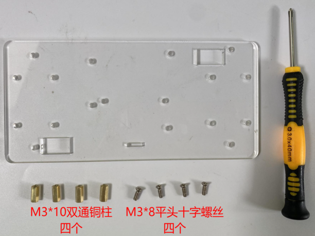

安装完成

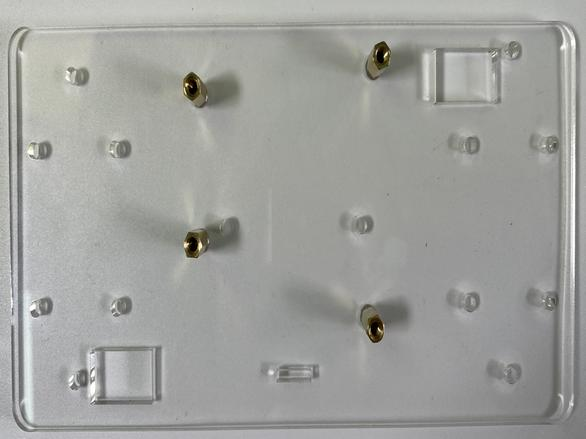

安装2

安装所需零件

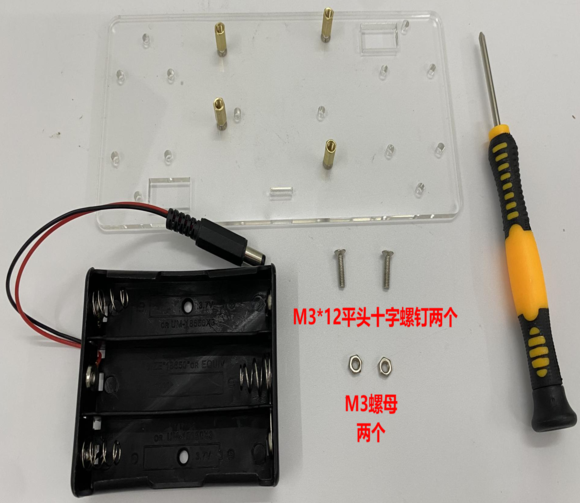

安装完成

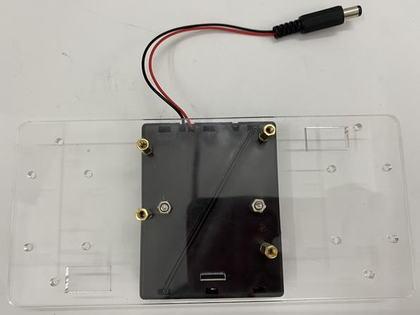

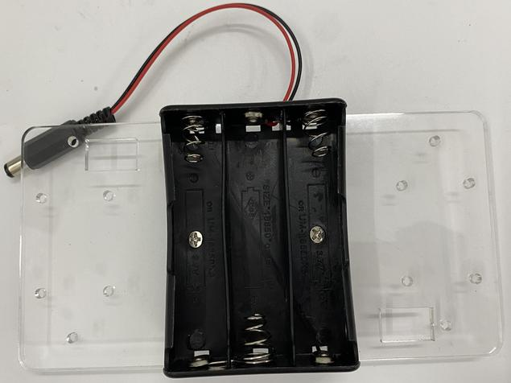

安装3

安装所需零件

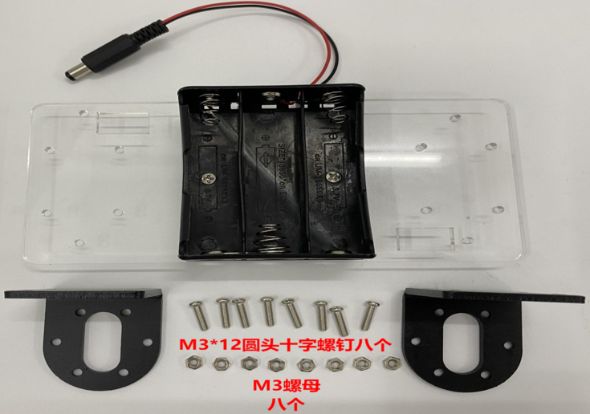

安装完成

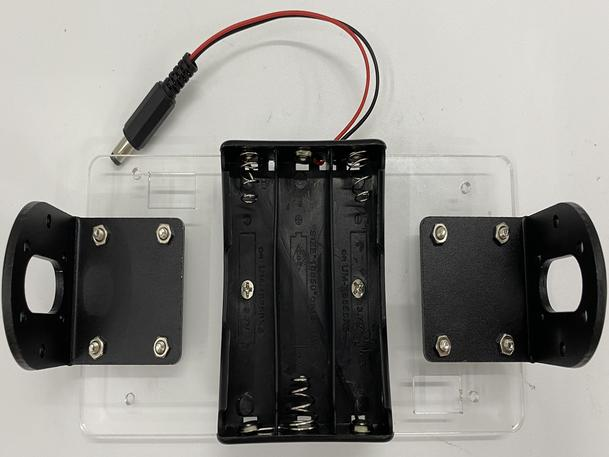

安装4

安装所需零件

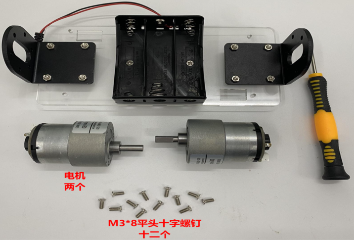

安装完成

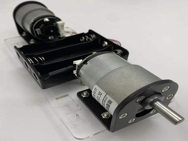

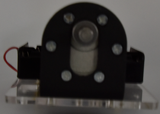

安装5

安装所需零件

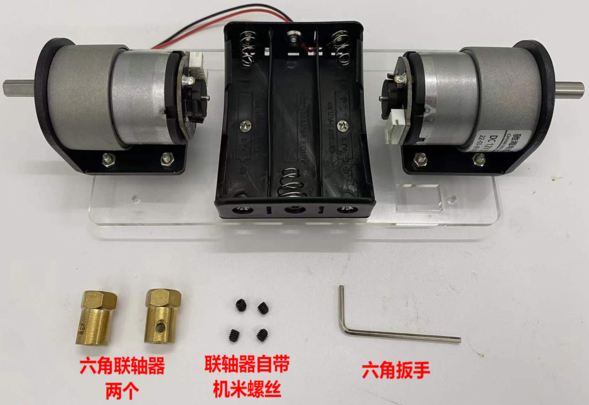

安 装完成

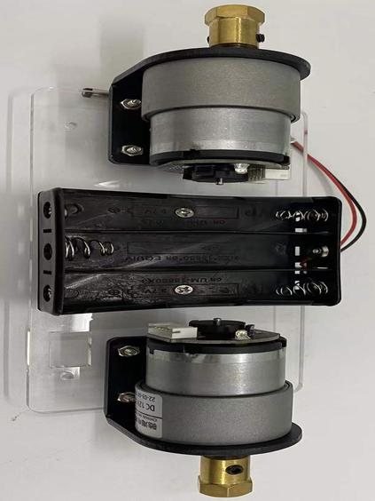

安装6

安装所需零件

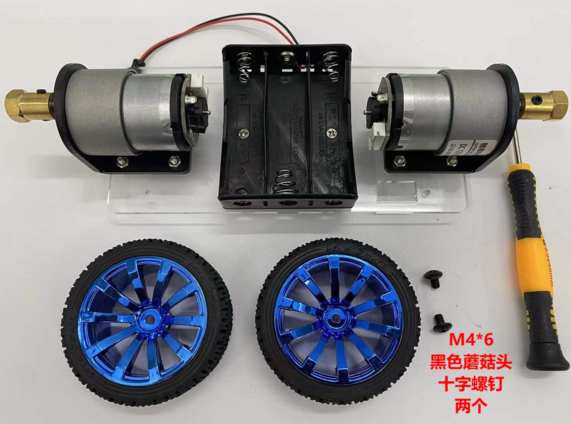

安 装

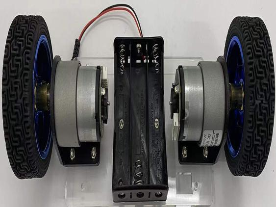

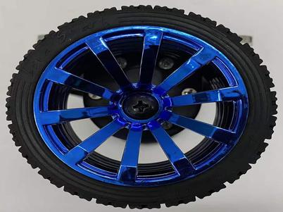

安装7

安装所需零件

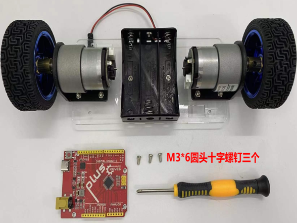

安装完成

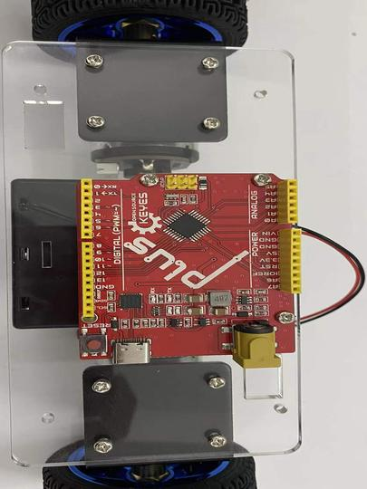

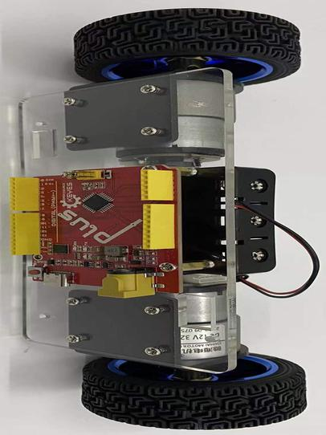

安装8

安装所需零件

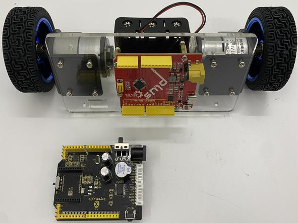

安装完成

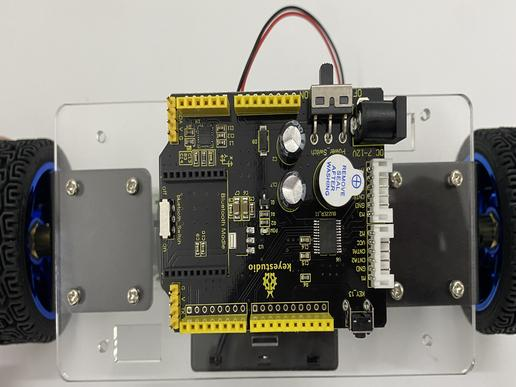

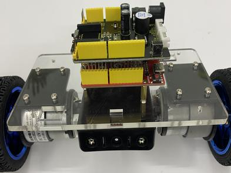

安装9

安装所需零件

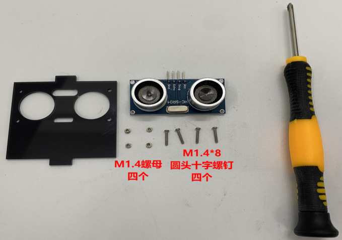

安装完成

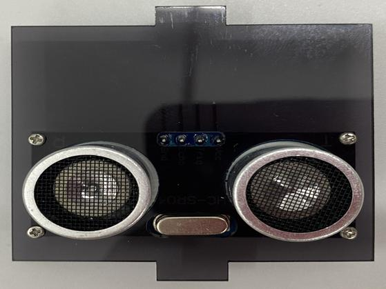

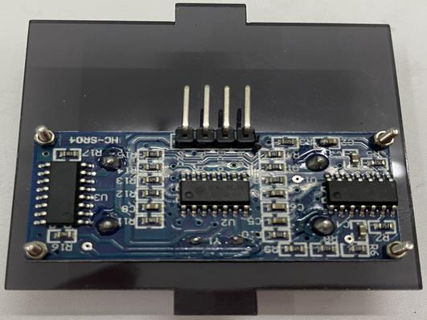

安装10

安装所需零件

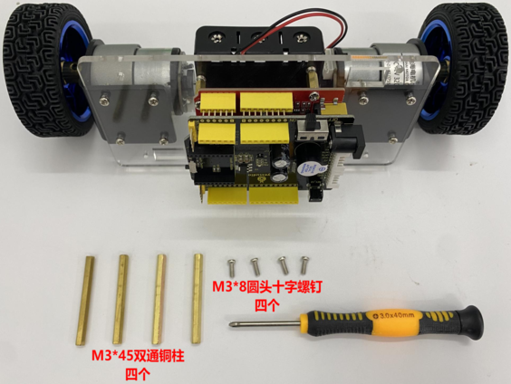

安装完成

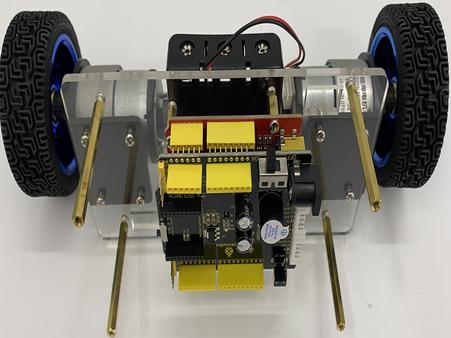

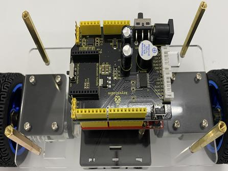

安装11

安装所需零件

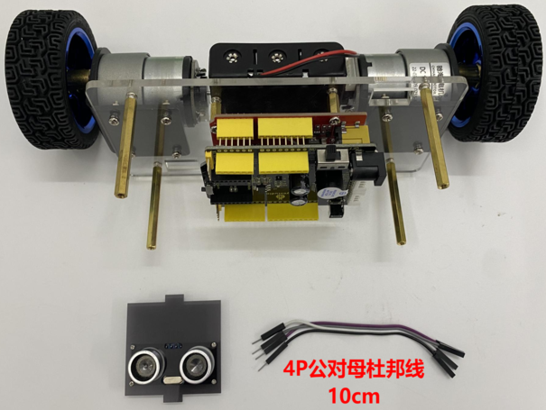

超声波接线

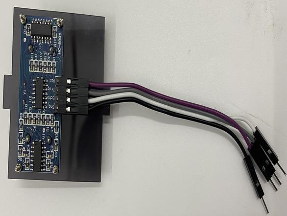

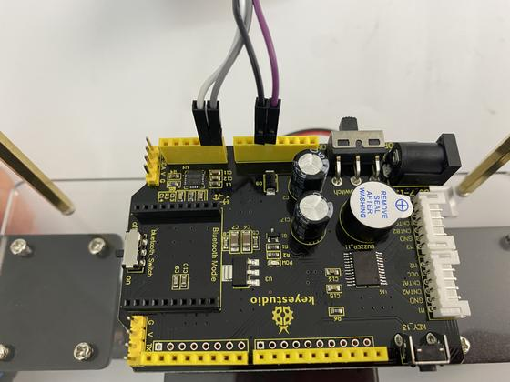

安装12

准备两根缠绕管跟两根6P线材

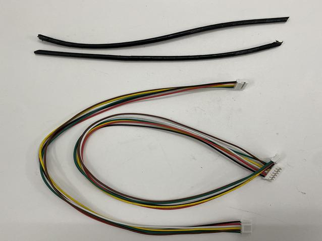

完成

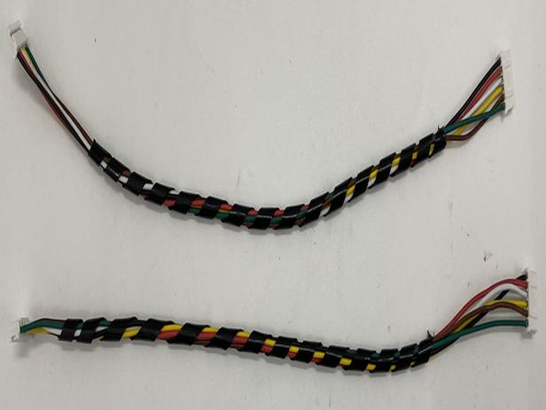

安装13

安装所需零件

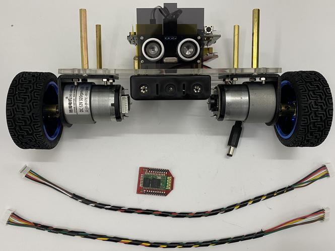

右侧电机接线

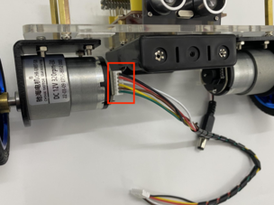

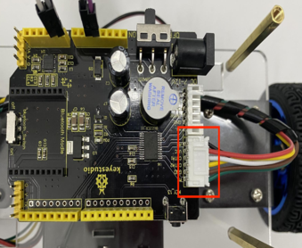

左侧电机接线

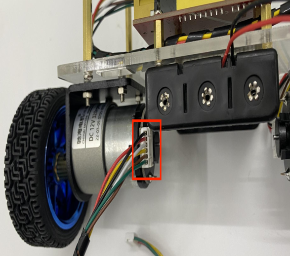

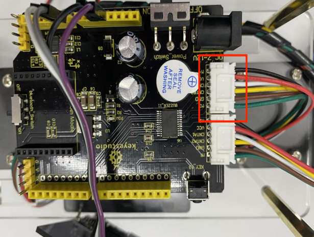

电源接线

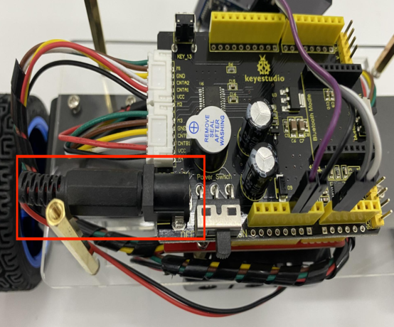

安装蓝牙

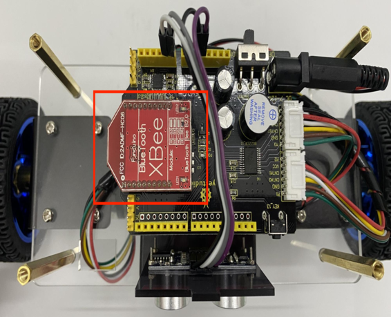

安装14

安装所需零件

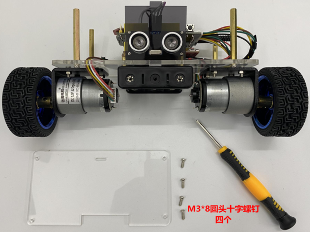

安装完成

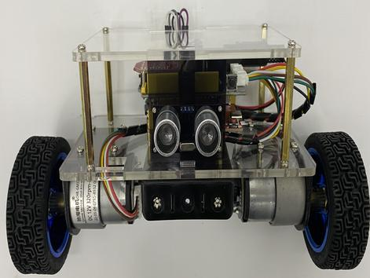

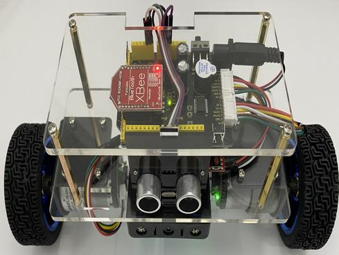

