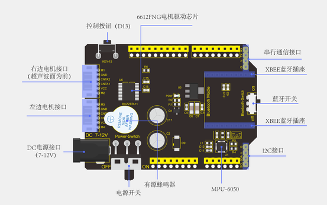

# 开发板介绍

###  说明

在我们进行DIY电子产品实验时，我们经常会用到arduino系列单片机在Arduino IDE开发环境上编程设置。Keyes Uno Plus 开发板是一款完全兼容Arduino IDE开发环境的控制板。它包含官网的 UNO R3板的所有功能，并且在 UNO R3板的基础上，我们做了一些改进，使它的功能更加强大。具体改进如下图。为了方便接线，我们还配了1根长度为1米的type-c接口的USB线。

### 规格参数

微控制器：ATMEGA328P-AU

USB转串口芯片：CP2102

工作电压：DC 5V

外接电源: DC 6-15V（建议9V）

数字I/O引脚: 14 (D0-D13)

PWM通道：6 (D3 D5 D6 D9 D10 D11)

模拟输入通道（ADC）: 8(A0-A7)

每个I/O直流输出能力: 20 mA

3.3V端口输出能力: 50 mA

Flash Memory: 32 KB（其中引导程序使用0.5 KB）

SRAM:2 KB (ATMEGA328P-AU)

EEPROM: 1 KB (ATMEGA328P-AU)

时钟速度:16MHz

板载LED引脚:D13

### 各个接口和主要元件说明

### 特殊功能接口说明

串口通信接口：D0为RX、D1为TX

PWM接口（脉宽调制）：D3 D5 D6 D9 D10 D11

外部中断接口：D2(中断0)和D3 (中断1)

SPI通信接口：D10为SS、D11为MOSI、D12为MISO、D13为SCK

IIC通信端口：A4为SDA、A5为SCL

# 平衡车扩展板介绍

1.简介

平衡车扩展板是这个小车的重要组成部分。有了它，能够让你DIY一个平衡车更简单方便。扩展板完全兼容REV4板，直接堆叠在扩展板就能够使用。同时扩展板自带1个6612FNG芯片，用于驱动两个直流电机；2个白色接口，用于连接直流电机；1个DC头可以同时给扩展板和REV4供电；1个大拨码开关用于控制电源开关；1个MPU-6050用于检测小车姿势；1个XBEE
蓝牙模块接口，可连接蓝牙模块，方便与安卓手机通讯；一个小拨码开关，用于控制蓝牙模块通信；自带一个按键控制和有源蜂鸣器；将REV4板的控制端口用排排母，将串口通信和I2C通信接口用排针引出。

2.接口说明

扩展板连接电机时，将电机和最近的电机接口连接即可。

