首先感谢选择keyes产品,

我们将继续为你提供好的产品和服务!

关于keyestudio

Keyes是KEYES Corporation旗下最畅销的品牌，我们的产品包括Arduino开发板、扩展板、传感器模块；树莓派、micro：bit扩展板和智能小车；以及为各阶段客户设计的完整入门套件。这些入门套件旨在为任何水平的客户学习Arduino、树莓派、micro：bit相关知识。

我们所有产品，均符合国际质量标准，在世界各地不同市场中，得到了极大的赞赏。

欢迎从我们的官方网站查看更多内容：

[www.keyes-robot.com](http://www.keyestudio.com)

获取资料和售后服务

1.平衡车资料下载地址：https://pan.baidu.com/s/1Wu6cL3B8JNyqYA112h-lJg 提取码：iao4 

2.如果发现某些东西丢失或损坏，或者学习套件时遇到一些困难。keyes会提供免费和快速的支持，如果您有任何疑问，请联系我们专业的销售人员。

3.欢迎提出建议和反馈，我们会根据您的反馈不断更新套件和教程，以使其更好。谢谢！

产品安全

1.本产品内含细小的零件（螺丝，铜柱等），请放在儿童接触不到的地方，防止划伤或误食。8岁及以下儿童使用，请在大人监督下使用。

2.本产品包含导电部件(控制板和电子模块），请按照本教程的要求进行操作，不当的操作可能导致过热并且损害零件，请勿触摸并立即断开电路电源。

版权

keyes商标和徽标是KEYES DIY ROBOT co.,LTD的版权,任何人和公司在没有授权的情况下，不得复制，售卖，转卖，keyes品牌的产品。如果您有兴趣在当地售卖我们的产品，请联系我们专业的批发销售人员。

Keyes 平衡车套件

# 产品介绍

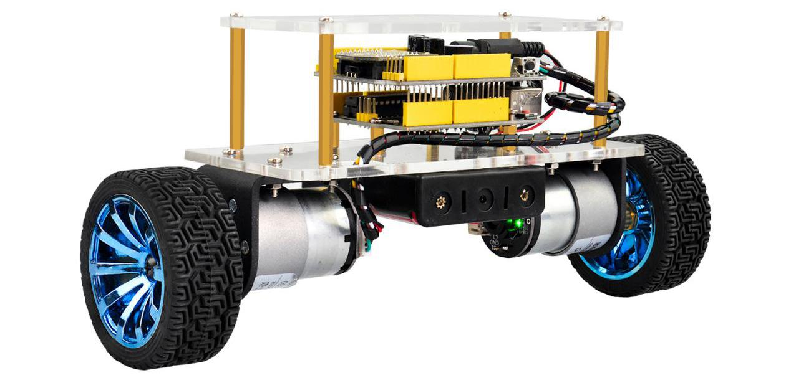

1.  产品介绍：

这是一款基于arduino平台搭建的两轮平衡车，平衡车采用陀螺仪MPU6050实时检测小车的运动姿态，核心控制板使用的是兼容arduino的Keyesb PLUS开发板。根据从传感器中获得的数据，经过PID算法处理之后，输出相应的控制信号到电机驱动电路，实现对小车电机的平衡控制.  
平衡小车添加了蓝牙模块，可以进行无线控制；还添加了超声波模块来实现避障控制。它在一定的活动空间内，能够进行灵活的转向和前进，以及避障、跟随动作。并能在快速运动中实现自主平衡，在外界有适度干扰的情况下还能够自行调整并迅速恢复平衡状态。  
以平衡小车为研究基础，后续可以搭载各种类型的传感器，能应用于复杂环境的勘探场合。

2.  产品特点：

本产品集成了超声波功能、蓝牙控制功能。Keyes Balance Car Shield V3平衡车扩展板自带1个6612FNG芯片，用于驱动两个直流电机；2个白色接口，用于连接直流电机；1个DC头可以同时给扩展板和REV4供电；1个大拨码开关用于控制电源开关；1个MPU-6050用于检测小车姿势；1个XBEE
蓝牙模块接口，可连接蓝牙模块，方便与安卓手机通讯；一个小拨码开关，用于控制蓝牙模块通信；自带一个按键控制和有源蜂鸣器；将Plus板的控制端口用排排母，将串口通信和I2C通信接口用排针引出。

3.  产品参数：

1.电机参数：

使用电压：DC12V 

减速比： 1:30 

空载电流：≤100mA 

空载转速：247rpm

额定转矩：1.4 Kg.cm 

额定转矩：137.3mN.m

额定转速：160rpm 

额定电流：≤0.45A 

堵转转矩：5.5 Kg.cm 

停转电流：2.4A

减速器长度：22mm

2.工作电压：DC 9-12V

3.电机驱动芯片：TB6612FNG

4.车体姿态检测：MPU-6050

5.自带电源控制开关

6.自带蓝牙控制开关，控制串口通信

# 产品清单

|序号|图片|规格|倍用量|
|-|-|-|-|
|1|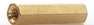|双通M3*45MM|4|
|2||双通M3*10MM|4|
|3|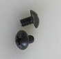|黑色蘑菇头 M4*6 十字|2|
|4|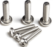|M3*6MM 圆头|6|
|5||M3*8MM 圆头|10|
|6|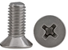|M3*8MM 平头 十字|16|
|7||M3*12MM 平头 十字|2|
|8||M3*12MM 圆头|10|
|9|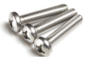|M1.4*8MM 圆头 十字 304不锈钢|4|
|10|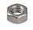|M1.4 镀镍|4|
|11|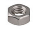|M3 镀镍|12|
|12|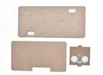|带超声波平衡车亚克力板三块|1|
|13|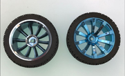|黑蓝 外径68mm 厚26mm 六角边套边到边12MM|2|
|14|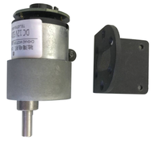|GM37-520直流减速,带霍尔编码器,12V，1：30，配L型标准支架|2|
|15|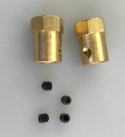|6MM孔*18MM长 铜|2|
|16|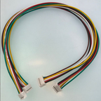|双头6芯 PH2.0绿棕黄白红黑 30CM 正向|2|
|17|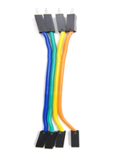|公对母10CM/40P/2.54/10股铜包铝 24号线BL|0.1|
|18|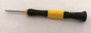|手柄颜色黄黑3*40MM十字螺丝刀|1|
|19|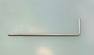|L型 M2 镀镍|1|
|20|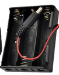|18650三节15CM露线适用于平衡车+插杆|1|
|21|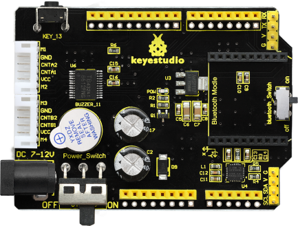|MPU-6050 Balance Car Shield V3平衡车扩展板 黑色环保|1|
|22|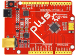|Keyes Uno Plus 开发板 红色环保|1|
|23|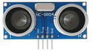|HC-SR04超声波传感器|1|
|24|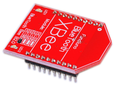|Keyes Bluetooh XBee蓝牙无线HC-06|1|
|25|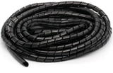|直径4MM 黑色（需要30CM 对半剪开成 2pcs 15cm的）|0.15|
|26|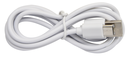|USB2.0对TYPE C 白色 L:1M OD：4.0MM|1|

